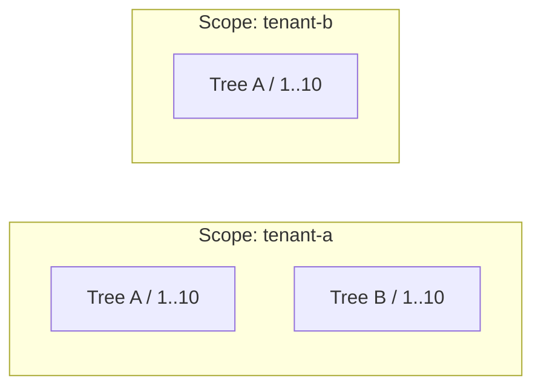

# Doka.EntityFrameworkCore.NestedSet

[](LICENSE)

`Doka.EntityFrameworkCore.NestedSet` adds persistent, ordered nested-set
hierarchies to ordinary Entity Framework Core entities. It keeps `TreeId`,
`Parent`, `Left`, `Right`, `Depth`, and sibling `Position` consistent while
nodes are inserted, moved, sorted, deleted, imported, validated, or rebuilt.

Typical uses include file systems, project KPIs, organizational units, user
groups, and permission groups. Domain data and relationships remain ordinary
EF Core data. The hierarchy does not implement authorization or domain-specific
aggregation rules.

## Packages and baseline

| Package | Purpose |
| --- | --- |
| `Doka.NestedSet` | Small EF-independent node and bounds contracts |
| `Doka.EntityFrameworkCore.NestedSet` | EF mapping, queries, mutations, ordering, transactions, validation, and rebuild |

The 10.x package line targets .NET 10 and EF Core 10. The EF package references
`Doka.NestedSet` transitively. Source builds default to `10.0.0-dev`; that
development version does not establish the availability of a stable release.

The provider qualification matrix is:

| Database | Provider |
| --- | --- |
| MySQL and MariaDB | `Doka.EntityFrameworkCore.MySql` |
| PostgreSQL | `Npgsql.EntityFrameworkCore.PostgreSQL` |
| SQLite | `Microsoft.EntityFrameworkCore.Sqlite` |
| SQL Server | `Microsoft.EntityFrameworkCore.SqlServer` |

Pomelo is not a supported provider. Ordinary EF migrations are the required
baseline. SafeMigrations is an optional additional gate.

`Doka.EntityFrameworkCore.NestedSet` 10.x does not support `PublishTrimmed` or
`PublishAot`. Its runtime model dispatch and dynamically composed EF queries
have not been qualified for trimming or NativeAOT. EF compiled-model tests
cover normal .NET execution, not NativeAOT publication.

## Data model

Every tree has a stable `TreeId` and its own `1..2N` coordinate space. An
optional Scope partitions tree identities, usually by tenant, project, or
volume. The complete identity is `(Scope, TreeId)` when Scope is configured and
`TreeId` otherwise.



Equal bounds in these trees do not collide. Anchor-based queries and structural
mutations use the configured Scope and the resolved or explicit `TreeId`.
`InTree(treeId)` selects one complete tree without mixing bounds from other trees.

```csharp
public sealed class Folder
{
    public long Id { get; private set; }
    public Guid TenantId { get; private set; }
    public Guid TreeId { get; private set; }
    public long? ParentId { get; private set; }
    public string Name { get; set; } = string.Empty;
    public string Type { get; set; } = string.Empty;
    public long Left { get; private set; }
    public long Right { get; private set; }
    public int Depth { get; private set; }
    public long Position { get; private set; }
}
```

`ParentId` and `Position` are the repairable adjacency source. `Left`, `Right`,
and `Depth` are derived read optimizations. A tree has exactly one root,
`Left >= 1`, `Right > Left`, `Depth >= 0`, and dense zero-based sibling
positions.

## Register once

Register the provider and NestedSet through the context options. Doka and
MariaDB 11.8 are the primary example:

```csharp
using Doka.EntityFrameworkCore.MySql;
using Doka.EntityFrameworkCore.NestedSet;

var serverVersion = MySqlServerVersion.MariaDb(new Version(11, 8, 0));

services.AddDbContext<ApplicationDbContext>(options => options
    .UseMySql(connectionString, serverVersion)
    .UseNestedSets());
```

`UseNestedSets()` installs the final model conventions, typed tree registry,
indexes, save guard, relational persistence boundary, provider capabilities,
and diagnostics. No `ConfigureConventions`, `modelBuilder.UseNestedSets()`,
constructor hook, or separate service registration is required.

Configure each hierarchy in its normal `IEntityTypeConfiguration<TEntity>`:

```csharp
internal sealed class FolderConfiguration : IEntityTypeConfiguration<Folder>
{
    public void Configure(EntityTypeBuilder<Folder> builder)
    {
        builder.ToTable("Folders");
        builder.HasKey(folder => folder.Id);

        builder.Property(folder => folder.Name)
            .HasMaxLength(256)
            .IsRequired();

        builder.Property(folder => folder.Type)
            .HasMaxLength(64)
            .IsRequired();

        builder.HasNestedSet(nestedSet => nestedSet
            .HasNodeKey(folder => folder.Id)
            .HasScope(folder => folder.TenantId)
            .HasTreeId(folder => folder.TreeId)
            .HasParent(folder => folder.ParentId)
            .HasBounds(folder => folder.Left, folder => folder.Right)
            .HasDepth(folder => folder.Depth)
            .HasPosition(folder => folder.Position)
            .OrderBy(folder => folder.Name)
            .ThenBy(folder => folder.Type)
            .HasOrderMode(NestedSetOrderMode.Strict));
    }
}
```

`.HasScope(...)` is optional. Without it, the facade is used without
`ForScope(...)`, and `TreeId` alone identifies the tree. Interfaces from
`Doka.NestedSet` can supply conventional property names, but existing entities
can map every role explicitly.

The convention creates or validates the restrictive self-reference. When the
application configures a navigation on a scoped hierarchy, its FK is
`(Scope, ParentId)` and its principal key is `(Scope, NodeKey)`. `TreeId` is not
part of that FK because a subtree can move to another tree inside the same
Scope.

## Compose SaveChanges

Explicit hierarchy operations need only `UseNestedSets()`. Normal payload
updates remain normal EF saves. Automatic reordering after a tracked Parent or
sort-property change requires the coordinated save wrapper.

Applications with their own context base and save rules compose it directly:

```csharp
public sealed class ApplicationDbContext : DbContext
{
    public ApplicationDbContext(DbContextOptions<ApplicationDbContext> options)
        : base(options) { }

    public DbSet<Folder> Folders => Set<Folder>();

    protected override void OnModelCreating(ModelBuilder modelBuilder)
    {
        base.OnModelCreating(modelBuilder);
        modelBuilder.ApplyConfigurationsFromAssembly(typeof(ApplicationDbContext).Assembly);
    }

    public override Task<int> SaveChangesAsync(
        bool acceptAllChangesOnSuccess,
        CancellationToken cancellationToken = default)
    {
        ApplyApplicationSaveRules();

        return this.SaveNestedSetChangesAsync(
            acceptAllChangesOnSuccess,
            token => base.SaveChangesAsync(false, token),
            cancellationToken);
    }

    public override int SaveChanges(bool acceptAllChangesOnSuccess)
    {
        ApplyApplicationSaveRules();

        // ReSharper disable once MethodHasAsyncOverload
        // WHY: This override implements EF Core's explicitly synchronous contract.
        return this.SaveNestedSetChanges(
            acceptAllChangesOnSuccess,
            () => base.SaveChanges(false));
    }

    private void ApplyApplicationSaveRules()
    {
        // Existing application-specific save preparation remains here.
    }
}
```

`NestedSetDbContext` provides the same wrapper for applications that do not
already own another base class. Synchronous saves support ordinary payload
changes and reject hierarchy work that needs asynchronous coordination.
Without either wrapper, the registered guard rejects Parent and sort-property
changes before SQL can persist inconsistent structure.

## Query and mutate through the facade

The standard entry point is short and metadata validated:

```csharp
var folders = context.NestedSet<Folder>()
    .ForScope(tenantId);
```

Create a tree and children without preloading a parent:

```csharp
var treeId = Guid.NewGuid();
var root = new Folder { Name = "Root", Type = "system" };
var documents = new Folder { Name = "Documents", Type = "folder" };

await folders.InsertRootAsync(root, treeId, cancellationToken);
await folders.InsertChildAsync(documents, root.Id, cancellationToken);
```

Anchor-based queries resolve `TreeId` and bounds in the same SQL statement and
remain composable:

```csharp
var matchingParent = await folders
    .AncestorsOf(documents.Id)
    .Where(folder => folder.Type == "system")
    .OrderByDescending(folder => folder.Depth)
    .FirstOrDefaultAsync(cancellationToken);

var matchingNodes = await folders
    .InTree(treeId)
    .Nodes
    .Where(folder => folder.Type == "folder")
    .ToListAsync(cancellationToken);
```

Queries are no-tracking by default and respect application query filters.
`InTree(treeId).Nodes`, `TreeContaining(nodeKey)`, `SubtreeOf(nodeKey)`,
`ChildrenOf(nodeKey)`, `DescendantsOf(nodeKey)`, `AncestorsOf(nodeKey)`, and
`ParentOf(nodeKey)` all preserve the required tree boundary. Complete trees are
in `Left` preorder. Applying a global business `OrderBy` to the result would no
longer represent hierarchical traversal.

The facade exposes atomic insert, move, detach, delete, bulk, validation, and
rebuild operations. `DetachAsTreeAsync(nodeKey, newTreeId)` creates a new tree;
`DeleteAsync` promotes children of a non-root; `DeleteSubtreeAsync` deletes one
branch; and `DeleteTreeAsync(treeId)` retires the complete identity.
Retired TreeIds remain tombstoned. The separately authorized
`PurgeTreeIdAsync(treeId)` administrative operation removes only an empty,
locked tombstone and is required before deliberate identity reuse.

## Ordering and tracked changes

Configured ordering applies independently to every sibling group. The node key
is the deterministic final tie breaker. Strict mode rejects manual placement;
`AllowManualPlacement` permits explicit before/after operations. Without an
order expression, sibling order is manual.

Changing `Name`, `Type`, or `ParentId` through a tracked entity and then calling
the coordinated `SaveChangesAsync` updates payload, bounds, depth, position,
and affected generated concurrency values atomically.

## Application transactions and retries

Without a transaction, a structural operation owns its transaction. With a
compatible caller transaction, it uses a savepoint and never commits or
disposes that transaction. Related domain writes can therefore be atomic with
the hierarchy change.

A retrying EF execution strategy must own the complete repeatable transaction
unit. Create the transaction inside its delegate, as required by EF Core:

```csharp
await using var strategyContext = await contextFactory
    .CreateDbContextAsync(cancellationToken);

var strategy = strategyContext.Database.CreateExecutionStrategy();

await strategy.ExecuteAsync(async token =>
{
    await using var context = await contextFactory.CreateDbContextAsync(token);
    await using var transaction = await context.Database.BeginTransactionAsync(token);
    var groups = context.NestedSet<UserGroup>().ForScope(tenantId);

    await groups.MoveToAsync(groupId, newParentId, token);
    context.RoleAssignments.Add(new RoleAssignment(userId, groupId, roleId));
    await context.SaveChangesAsync(token);
    await transaction.CommitAsync(token);
}, cancellationToken);
```

The application owns retry and commit. A configured retry strategy with a
transaction outside its delegate is rejected before hierarchy SQL. A connection
failure during commit can have an unknown outcome; reconcile it from a fresh
context instead of blindly replaying an isolated range update.

## Bulk, validation, and migrations

`NestedSetBranch<TEntity>` describes detached adjacency. `InsertSubtreeAsync`
imports one branch beneath an existing parent. `InsertForestAsync` associates
every root branch with an explicit `NestedSetTreeImport<TEntity, TTreeId>`.
Planning is iterative and stack safe; writes use bounded batches inside one
transaction or caller savepoint.

```csharp
await folders.InsertForestAsync(
    [
        new NestedSetTreeImport<Folder, Guid>(
            firstTreeId,
            new NestedSetBranch<Folder>(firstRoot, [new(firstChild)])),
        new NestedSetTreeImport<Folder, Guid>(
            secondTreeId,
            new NestedSetBranch<Folder>(secondRoot)),
    ],
    cancellationToken);
```

Maintenance is bound to an exact tree:

```csharp
var tree = folders.InTree(treeId);
var report = await tree.ValidateAsync(NestedSetValidationLevel.Full, cancellationToken);

if (!report.IsValid)
{
    var plan = await tree.PlanRebuildAsync(cancellationToken);

    if (plan.CanRebuild)
    {
        await tree.RebuildAsync(cancellationToken);
    }
}
```

The final model convention derives indexes for tree bounds, reverse ancestor
scans, parent/position lookups, and configured sibling ordering. Generate and
review an ordinary EF migration after enabling the hierarchy. See
[migrations and indexes][migrations] for the exact index and typed registry
contract.

## Build and install from source

Use the exact SDK declared in [global.json](global.json). Restore and build
the shipping EF project, which also builds its core project dependency:

```bash
dotnet restore src/Doka.EntityFrameworkCore.NestedSet/Doka.EntityFrameworkCore.NestedSet.csproj --locked-mode
dotnet build src/Doka.EntityFrameworkCore.NestedSet/Doka.EntityFrameworkCore.NestedSet.csproj -c Release --no-restore
```

Create both development packages in a local feed:

```bash
dotnet pack src/Doka.NestedSet/Doka.NestedSet.csproj -c Release --no-build --no-restore -o artifacts/packages
dotnet pack src/Doka.EntityFrameworkCore.NestedSet/Doka.EntityFrameworkCore.NestedSet.csproj -c Release --no-build --no-restore -o artifacts/packages
```

Add the output directory as a package source in the consuming application's
`NuGet.Config`, retaining the existing sources for EF Core and its provider:

```xml
<configuration>
  <packageSources>
    <add key="nestedset-local" value="/absolute/path/to/artifacts/packages" />
  </packageSources>
</configuration>
```

Then install the EF package in that application:

```bash
dotnet package add Doka.EntityFrameworkCore.NestedSet --version 10.0.0-dev
```

The core package is resolved transitively from the same feed. The application
also references its chosen EF provider; the NestedSet runtime does not select
or install a database provider.

## Tests

The core and unit suites run without Docker:

```bash
dotnet restore tests/Doka.NestedSet.Tests/Doka.NestedSet.Tests.csproj --locked-mode
dotnet test tests/Doka.NestedSet.Tests/Doka.NestedSet.Tests.csproj -c Release --no-restore
dotnet restore tests/Doka.EntityFrameworkCore.NestedSet.Unit.Tests/Doka.EntityFrameworkCore.NestedSet.Unit.Tests.csproj --locked-mode
dotnet test tests/Doka.EntityFrameworkCore.NestedSet.Unit.Tests/Doka.EntityFrameworkCore.NestedSet.Unit.Tests.csproj -c Release --no-restore
```

| Test project under `tests/` | Coverage |
| --- | --- |
| `Doka.NestedSet.Tests` | EF-independent bounds and node predicates |
| `Doka.EntityFrameworkCore.NestedSet.Unit.Tests` | Mapping, dispatch, planning, and regression guards |
| `Doka.EntityFrameworkCore.NestedSet.MySql.Tests` | Doka MySQL and MariaDB, with independent engine fixtures |

Provider projects inherit shared contracts from
`Doka.EntityFrameworkCore.NestedSet.Specification.Tests`; the specification
library is not an executable test project. Run an individual provider project
with the same `dotnet restore` and `dotnet test` commands. MySQL, MariaDB,
PostgreSQL, and SQL Server cases need Docker. SQLite cases use local databases.

## Documentation

- [Documentation index](docs/README.md)
- [Architecture decisions](docs/decisions/README.md)
- [Package usage guide](src/README.md)
- [Bulk import][bulk-import]
- [Migrations and indexes][migrations]

## License

The product is MIT-licensed. See [LICENSE](LICENSE). The adapted
[Code of Conduct](CODE_OF_CONDUCT.md#policy-basis-and-attribution) is
separately licensed under
[CC BY-SA 4.0](https://creativecommons.org/licenses/by-sa/4.0/).

[bulk-import]: docs/bulk-import.md
[migrations]: docs/migrations.md
