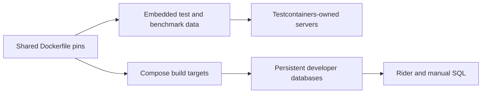

# Local developer databases

These optional databases support manual SQL experiments, the runnable samples, and Rider database browsing. Automated tests and benchmarks
continue to create and dispose their own containers through Testcontainers; they do not connect to this Compose project.
SQLite runs in process and needs no Compose service.



## Prerequisites and image selection

Use Docker Engine or Docker Desktop with Linux containers, BuildKit, and Docker Compose v2 supporting `--wait` and
`--wait-timeout`. Check `docker compose version` and `docker compose up --help`. No database client or repository build
is required to start a service. SQL Server uses Developer edition with `ACCEPT_EULA=Y` for local development.

[`database-images.Dockerfile`](database-images.Dockerfile) is the canonical image manifest for fixtures and developer
databases. Compose [builds a named target][build-target] from its FROM-only stages. With [BuildKit][buildkit], only the
selected stage and its dependencies are processed. No source is copied into an image.
The resulting locally built image inherits the pinned vendor image, but its exported image or manifest digest can differ
from the vendor digest. Do not use digest equality to identify the locally built image as the vendor artifact.

SQL Server selects `linux/amd64`. Microsoft's [supported host boundary][sql-hosts] is Linux on Intel/AMD x86-64.
Arm emulation, including Docker Desktop on Apple Silicon, is unqualified and unsupported by Microsoft; a successful
local startup does not establish support. Compose imposes no CPU or memory limits. Allocate enough Docker memory for
the engines you start, especially SQL Server.

## Start one engine

Run these commands from the repository root. Each command starts only its named profile; multiple `--profile` options
can start multiple engines. [`--wait`](https://docs.docker.com/reference/cli/docker/compose/up/) waits for an
authenticated `SELECT 1` healthcheck and leaves the service running in the background.

PostgreSQL's probe uses the Compose service address rather than loopback because
the vendor image trusts local connections by default. This also checks the
configured password against existing accounts in a reused volume.

```sh
docker compose -f docker/compose.yml --profile mysql up --build --wait --wait-timeout 180
docker compose -f docker/compose.yml --profile mariadb up --build --wait --wait-timeout 180
docker compose -f docker/compose.yml --profile postgres up --build --wait --wait-timeout 180
docker compose -f docker/compose.yml --profile sqlserver up --build --wait --wait-timeout 180
```

Keep `--build` when starting again after a manifest update so Compose rebuilds the selected image. Named volumes survive
image replacement; follow the database vendor's upgrade rules when reusing data across versions.

## Connect from Rider

The defaults below are **LOCAL-ONLY development credentials**. Published ports bind to `127.0.0.1`.

| Engine/profile | Host | Port | Database | User | Password |
| --- | --- | --- | --- | --- | --- |
| MySQL | `127.0.0.1` | `33068` | `nestedset` | `nestedset` | `nestedset-local-mysql` |
| MariaDB | `127.0.0.1` | `33069` | `nestedset` | `nestedset` | `nestedset-local-mariadb` |
| PostgreSQL | `127.0.0.1` | `54328` | `nestedset` | `nestedset` | `nestedset-local-postgres` |
| SQL Server | `127.0.0.1` | `14338` | `master` | `sa` | `NestedSet_Local_Sa_123!` |

In Rider, open **View > Tool Windows > Database**, add the matching MySQL, MariaDB, PostgreSQL, or Microsoft SQL Server
data source, and enter the host, port, database, user, and password above. Download the offered JDBC driver, then choose
**Test Connection**. For the local SQL Server self-signed certificate, set `trustServerCertificate=true` in the
data source connection properties; its healthcheck uses the equivalent `sqlcmd -C` option.

MySQL and MariaDB create the `nestedset` application user with access to the `nestedset` database. Their administrative
`root` passwords are `nestedset-local-mysql-root` and `nestedset-local-mariadb-root`, respectively; use an in-container
client for root administration. PostgreSQL's initialization user is a superuser.
SQL Server initially uses `master`. To experiment with application data, run the following once in a Rider query
console, then change that data source's database to `nestedset`:

```sql
CREATE DATABASE nestedset;
```

## Provision the runnable Doka samples

MySQL and MariaDB also provide three fixed databases for the
[independent console samples](../samples/README.md): `nestedset_sample_filesystem`,
`nestedset_sample_kpis`, and `nestedset_sample_usergroups`. They use the configured
application account with database-specific grants. Sample databases use
`utf8mb4_bin` to keep the small ASCII demonstration datasets' comparison rules
explicit on both engines.

The read-only-mounted [provisioning script](provision-samples.sh) runs automatically
when a new volume is initialized. Vendor entrypoints skip initialization scripts
for existing data directories, so provision an existing developer service explicitly:

```sh
docker compose -f docker/compose.yml exec -T mariadb bash -s < docker/provision-samples.sh
docker compose -f docker/compose.yml exec -T mysql bash -s < docker/provision-samples.sh
```

Run only the command for the service you started. Repeated provisioning creates
missing databases and refreshes the exact database grants; it preserves existing
tables and data, including the general `nestedset` database. Underscores in GRANT
database patterns are escaped so the permission does not match other names.
The script obtains administrative credentials from the configured container
environment and does not print them. If an existing account's password was
changed manually, the matching container environment must already be correct.

A sample's explicit `--reset` recreates only its fixed database. Its normal run
and `--inspect` do not reset previous results. PostgreSQL and SQL Server remain
available for manual developer work; these three samples focus on Doka and
optional SQLite, while the automated provider suites own the wider matrix.

The initialization behavior is defined in the official
[MySQL entrypoint](https://github.com/docker-library/mysql/blob/master/8.4/docker-entrypoint.sh)
and [MariaDB 11.8 entrypoint](https://github.com/MariaDB/mariadb-docker/blob/master/11.8/docker-entrypoint.sh).

## Inspect and stop

```sh
docker compose -f docker/compose.yml --profile '*' ps
docker compose -f docker/compose.yml --profile mysql logs --tail 100 mysql
docker compose -f docker/compose.yml --profile '*' down
```

Replace `mysql` with the desired engine for its logs. `down` stops and removes this project's containers and network
while preserving the named data volumes of initialized services. A later `up` reuses the selected engine's data.

For an explicit reset that **deletes all database data for this Compose project**, use
[`down --volumes`](https://docs.docker.com/reference/cli/docker/compose/down/):

```sh
docker compose -f docker/compose.yml --profile '*' down --volumes
```

Resources belong to the `doka-nestedset-dev` project. There are no external volumes, fixed container names, or
containers shared with Testcontainers. The reset command does not manage other projects or automated test containers.

## Configuration and worktrees

Override values in your shell before `up`; `:-` in Compose makes unset or empty overrides use the defaults.

| Prefix | Available suffixes |
| --- | --- |
| `NESTEDSET_DEV_MYSQL_` | `PORT`, `DATABASE`, `USER`, `PASSWORD`, `ROOT_PASSWORD` |
| `NESTEDSET_DEV_MARIADB_` | `PORT`, `DATABASE`, `USER`, `PASSWORD`, `ROOT_PASSWORD` |
| `NESTEDSET_DEV_POSTGRES_` | `PORT`, `DATABASE`, `USER`, `PASSWORD` |
| `NESTEDSET_DEV_SQLSERVER_` | `PORT`, `SA_PASSWORD` |

For example, `NESTEDSET_DEV_MYSQL_PORT=33078` selects a different host port. MySQL and MariaDB `USER` overrides must
name an application user, not `root`. SQL Server passwords must satisfy its password policy. Do not put production
secrets in this local setup or commit personal overrides.

Database/user/password variables initialize **new, empty volumes**; changing them does not change existing database
accounts or recreate an existing database. If you change a stored password through SQL, update the matching shell
override too so the healthcheck and your client agree. To reinitialize with different credentials, explicitly reset
disposable data with `down --volumes` before starting again; keep the existing credentials if you need to retain
the data.

Two worktrees using the default project name address the same containers and volumes, and their default published ports
also collide. Choose a unique [project name](https://docs.docker.com/compose/how-tos/project-name/) with `-p` or
`COMPOSE_PROJECT_NAME` and different ports for every engine you start:

```sh
NESTEDSET_DEV_MYSQL_PORT=33078 docker compose -p doka-nestedset-dev-feature \
  -f docker/compose.yml --profile mysql up --build --wait --wait-timeout 180
docker compose -p doka-nestedset-dev-feature -f docker/compose.yml --profile '*' ps
docker compose -p doka-nestedset-dev-feature -f docker/compose.yml --profile '*' down
```

Use the same project override for subsequent commands, including an intentional `down --volumes` reset.

[build-target]: https://docs.docker.com/reference/compose-file/build/#target
[buildkit]: https://docs.docker.com/build/building/multi-stage/#differences-between-legacy-builder-and-buildkit
[sql-hosts]: https://learn.microsoft.com/en-us/sql/linux/sql-server-linux-release-notes-2025?view=sql-server-ver17
