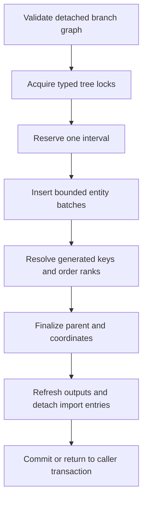

# Bulk import

Bulk insertion accepts a complete in-memory adjacency tree, validates it, opens
one coordinate interval, inserts the new entities, and finalizes their nested-
set structure in one atomic boundary. It is intended for new forests and new
subtrees whose complete topology is already available.

## Build the input

`NestedSetBranch<TEntity>` owns one entity and its direct child branches:

```csharp
var source = new NestedSetBranch<Folder>(
    new Folder("src", "folder"),
    [
        new NestedSetBranch<Folder>(new Folder("Core", "folder")),
        new NestedSetBranch<Folder>(
            new Folder("Providers", "folder"),
            [
                new NestedSetBranch<Folder>(new Folder("MySql", "folder")),
                new NestedSetBranch<Folder>(new Folder("PostgreSql", "folder")),
            ]),
    ]);

await folders.InsertSubtreeAsync(source, repository.Id, cancellationToken);
```

Alternatively, create fresh detached branches for `InsertForestAsync` to add
several independently identified trees to the bound Scope. Do not reuse the
entities from an earlier import:

```csharp
var sourceTreeId = Guid.NewGuid();
var testsTreeId = Guid.NewGuid();
var sourceTree = new NestedSetBranch<Folder>(
    new Folder("src", "folder"),
    [new NestedSetBranch<Folder>(new Folder("Core", "folder"))]);
var testsTree = new NestedSetBranch<Folder>(
    new Folder("tests", "folder"),
    [new NestedSetBranch<Folder>(new Folder("Unit", "folder"))]);

await folders.InsertForestAsync(
    [
        new NestedSetTreeImport<Folder, Guid>(sourceTreeId, sourceTree),
        new NestedSetTreeImport<Folder, Guid>(testsTreeId, testsTree),
    ],
    cancellationToken);
```

The same entity reference may occur only once. Reuse would describe either a
cycle or multiple parents and is rejected. Null branches, tracked entities,
duplicate assigned keys, arithmetic overflow, and an invalid destination are
also rejected before or within the transaction.

## Keys

Assigned and store-generated single-property keys are supported. For generated
keys, the library first inserts the entities, reads their identities, and then
finalizes parent values and coordinates. It does not require an application key
callback.

Every input entity must be detached. The import owns its temporary EF entry
state and structural property assignments. Existing tracked nodes remain
outside the import set.

Assigned keys keep their original database identity throughout the import.
Callbacks cannot replace that identity or mutate a binary key in place. The
library verifies keys both before and after each payload save; only genuinely
generated keys replace the plan's initial key representation.

## Scope and structural values

The facade's bound Scope and each import's explicit TreeId are authoritative.
Imported Scope, TreeId, Parent, bounds, depth, and position values are
overwritten. Treat those properties as outputs:

```text
Application input: payload fields and branch topology
Library output: scope, tree identity, parent, left, right, depth, position
Database output: generated key and other configured generated values
```

Each imported tree width is `2 * its node count`. Overflow and impossible depth
or position values fail before structural SQL proceeds.

## Ordering

Without a configured sibling order, branch order defines root and child
positions. With `OrderBy`, the database values determine the order of each
imported sibling group. The same collation and tie-breaking rules as ordinary
insertion apply.

In strict mode, the imported branches become part of the canonical configured
order. In `AllowManualPlacement` mode, existing manually arranged siblings
retain their relative order while the new branches are inserted according to
their configured predecessor.

## Atomic execution

The import uses the ordinary mutation lock and transaction protocol:



If the caller already owns a compatible transaction, import uses a savepoint
and leaves the final commit to the caller. That allows related domain rows to
be created atomically with the hierarchy.

Every active EF insertion batch contains at most 64 entities plus their owned
payload. All batches execute inside the same outer transaction or caller
savepoint, so a failure in a later batch rolls back the complete import. The
individual saves do not create additional EF auto-savepoints because the
mutation executor already owns the complete rollback boundary.

EF save callbacks run once per insertion batch. They must therefore be safe for
repeated invocation within one bulk operation.

## Failure and restoration

When a definite failure rolls back the database, the library restores the
caller's original CLR hierarchy values, generated keys, defaults, computed
values, and generated root, complex, and owned leaves, and releases every
import-owned entry. Owned keys and ownership foreign keys also return to their
original CLR values before relationship fixup, even when configured as
`ValueGenerated.Never`. These insertion-owned values are retained across completed
payload waves, including caller-visible collection keys. The retained state
grows with the application's generated and owned model; the plain-root capacity
fixture does not allocate owned-value snapshots.
Ordinary payload remains application-owned: the library does not reverse
payload changes or non-ownership business foreign keys changed by application
save callbacks. Ordinary audit or outbox
writes that EF accepted with an earlier batch return to their pending state, so
the tracker never reports rows that the rollback removed. If restoration fails,
an `AggregateException` preserves both errors and the context must be discarded.

Generated input values are captured immediately before their own batch is
staged. Inputs not yet reached by an early failure retain their original
generated payload. Root generated CLR reads and structural CLR assignments
finish before creating its EF entry. Owned graph entries are collected before
their first tracking transition; owned generated reads occur within that
protected initialization. A throwing getter, setter, or tracking callback
therefore has exact introduced entries available for cleanup. Final refresh and generated
rollback use metadata-cached mapped setters without clearing or retracking
unrelated application state. Shadow properties have no detached CLR value to
refresh; their persisted values remain available through normal queries.

Tracking can fail before an entry becomes Added, or after EF installs only
some of its keys. Cleanup owns each introduced root and owned dependent from
its first entry creation. It removes that exact entry's partial registrations;
an existing entity with a colliding key remains tracked. Installed key
snapshots also protect cleanup when callbacks replace a scalar key or mutate a
converted mutable key or Scope in place. The lifecycle handles cover only the
active insertion batch and its owned payload, not the entire input forest.

If a prohibited callback changes a mutable key, explicitly runs EF change
detection, and then mutates the newly installed key again, EF itself can retain
a hash slot that no key lookup can recover. Failed cleanup checks the exact
touched maps once for surviving introduced entries. It does not repair private
dictionary storage or clear caller state. Any residual produces the aggregate
recovery error and requires discarding the context, even though the database
was rolled back. This audit is failure-only, uses memory proportional to the
active batch, and takes time proportional to entries in the touched maps;
successful import does not scan those maps.

Insertion keys must remain unchanged throughout a callback, including before
an explicit `DetectChanges`. Boundary checks compare the observable identities;
they are not an event history of transient edits reverted inside application
code. Mutating a key, rekeying EF, and restoring the CLR value before returning
violates this contract even when the final-value guard cannot see the edit.

Provider-generated identities are captured after persistence and before EF
acceptance or `SavedChanges`. A legitimate generated key is retained; a
callback's CLR key edit is rejected even while EF holds the actual generated
value in a sidecar. Forest and subtree import share this boundary. These exact
cleanup operations use a version-qualified EF infrastructure seam; its limits
and upgrade triggers are recorded in
[D-004](decisions/D-004-atomic-mutations-and-locks.md) and
[D-007](decisions/D-007-atomic-bulk-import.md).

Save callbacks may update ordinary payload values. For an exact-TreeId import,
this includes already-tracked nodes in unaffected trees. Callbacks must not:

- add or remove hierarchy entities from the planned import;
- replace an assigned key's database identity;
- change scope, TreeId, parent, bounds, depth, position, or configured ordering properties;
- detach imported entries; or
- start a recursive save.

They may also add non-hierarchy audit or outbox entities in `SavingChanges`;
these rows participate in the same EF save and transaction as the import batch.
An entity added in `SavedChanges` is pending for a later save and does not
participate in the completed batch.

The library verifies staged structure before persistence and after save
callbacks, including before acceptance in the coordinated context path. It
rejects a callback that breaks these rules.

Cancellation stops forward progress and rolls the transaction back. Cleanup is
not canceled with the caller token. A commit exception can still have an
unknown server outcome; do not retry the same import blindly.

## Resource model

Import retains one compact plan node per input entity. EF entries exist only for
the active 64-node batch and its owned payload. Conventional sentinel-valued
input structure allocates no per-node rollback object; non-sentinel input values
use sparse rollback snapshots. Traversal is iterative, so a deep input does not
consume the CLR call stack, but the complete immutable input topology and compact
plan must fit in memory.

Generated CLR values use the same sparse restoration strategy: conventional
sentinel-valued inputs allocate no per-node generated-value snapshot. An input
with an explicit non-sentinel value for a store-generated property retains one
compact snapshot array so a definite rollback can restore that exact value.

The deterministic release tests qualify one million direct children, 100,000
levels, and a retained plan budget of at most 320 MiB per million nodes. The
remaining 192 MiB of the 512 MiB total target is reserved for native ordering
ranks, query buffers, and the active EF batch.

The operation opens the destination interval once rather than once per node. It
streams neither the caller's topology nor provider-native bulk-copy input; it
does bound EF tracking and database commands. For a data set too large to retain
safely, split it into independently meaningful subtrees and import each subtree
as a separate application transaction.

## Verification

After an import, verify domain counts and structural integrity:

```csharp
var report = await folders
    .InTree(treeId)
    .ValidateAsync(NestedSetValidationLevel.Full, cancellationToken);

if (!report.IsValid)
{
    throw new InvalidOperationException(
        string.Join(Environment.NewLine, report.Issues.Select(issue => issue.Message)));
}
```

For a production migration, also compare expected roots, parent identities,
and application payload counts. Structural validity alone cannot prove that an
input mapping assigned the intended business parent.
