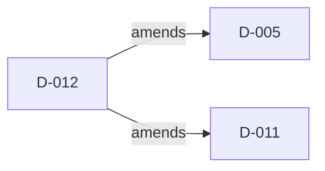

# Architecture decisions

<!-- Generated by eng/validate-adrs.sh --write-index. Do not edit. -->

These records use [MADR 4.0.0 with the Doka profile](MADR-PROFILE.md). Start from the
[template](adr-template.md). ADR front matter is authoritative; this page and
[decision-index.json](decision-index.json) are deterministic navigation views.

A proposed record is open for review. Recording an existing implementation does not
establish historical approval, consultation, or release qualification. Recording dates
identify when the record was created; decision history carries later status changes.

Validate with `eng/validate-adrs.sh`; regenerate with `eng/validate-adrs.sh --write-index`.

| ID | Status | Recording date | Title | Relationships |
| --- | --- | --- | --- | --- |
| [D-001](D-001-madr-profile-and-decision-governance.md) | implemented | 2026-09-19 | Record material decisions with the full Doka MADR profile | None |
| [D-002](D-002-package-boundaries.md) | implemented | 2026-09-19 | Keep a small core separate from EF persistence | None |
| [D-003](D-003-scoped-forests-and-adjacency.md) | implemented | 2026-09-19 | Identify each tree with a stable TreeId and optional Scope | None |
| [D-004](D-004-atomic-mutations-and-locks.md) | implemented | 2026-09-19 | Serialize writers through typed per-tree registry locks | None |
| [D-005](D-005-database-ordering-and-savechanges.md) | implemented | 2026-09-19 | Integrate configured ordering with asynchronous saves | amended-by D-012 |
| [D-006](D-006-validation-and-adjacency-repair.md) | implemented | 2026-09-19 | Validate iteratively and repair derived structure from adjacency | None |
| [D-007](D-007-atomic-bulk-import.md) | implemented | 2026-09-19 | Import a complete branch through EF with bounded structural batches | None |
| [D-008](D-008-provider-neutral-indexes-and-migrations.md) | implemented | 2026-09-19 | Keep supporting indexes independent of optional migration adapters | None |
| [D-009](D-009-bounded-diagnostics-and-application-ownership.md) | implemented | 2026-09-19 | Expose bounded diagnostics while applications own access and context lifetime | None |
| [D-010](D-010-delete-mapped-table-fragments.md) | implemented | 2026-09-24 | Delete every mapped table fragment in bounded batches | None |
| [D-011](D-011-feature-oriented-source-layout.md) | implemented | 2026-09-25 | Group hierarchy behavior by feature | amended-by D-012 |
| [D-012](D-012-typed-tree-runtime.md) | implemented | 2026-09-26 | Carry typed tree identities through feature execution | amends D-005; amends D-011 |
| [D-013](D-013-provider-owned-integration-test-projects.md) | implemented | 2026-09-25 | Give each database provider its own integration test project | None |
| [D-014](D-014-shared-database-images-and-developer-compose.md) | implemented | 2026-09-29 | Share database image pins with optional developer Compose | None |
| [D-015](D-015-benchmarkdotnet-development-measurements.md) | accepted | 2026-09-28 | Use BenchmarkDotNet for optional development measurements | None |
| [D-016](D-016-release-candidate-evidence-and-publication.md) | accepted | 2026-09-19 | Qualify immutable candidates before operator-controlled publication | None |
| [D-017](D-017-madr-profile-and-decision-validation.md) | implemented | 2026-09-19 | Validate decision records independently of release qualification | None |

## Relationships

