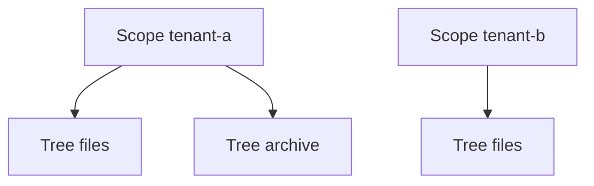

# Hierarchy model

NestedSet persists adjacency and nested-set coordinates together. `Parent` and
`Position` express repairable structure. `Left`, `Right`, and `Depth` optimize
ordered containment queries.

## Tree identity and Scope

Every tree has one stable `TreeId`. Each tree owns an independent coordinate
space starting at one:

```text
Scope = tenant-a

TreeId = files                    TreeId = archive
/ [1, 6]                         / [1, 6]
|- Documents [2, 3]              |- 2025 [2, 3]
`- Home [4, 5]                   `- 2026 [4, 5]
```

Equal bounds across these trees are valid because every structural predicate
includes TreeId. Scope is an optional additional partition. When configured,
the complete identity is `(Scope, TreeId)`, so the same TreeId can appear in
another tenant:



Scope is application data and not an authorization decision. The application
must authorize the selected tenant, project, or volume before calling
`ForScope(scope)`.

An unscoped hierarchy omits the Scope property and uses TreeId alone. NestedSet
does not infer Scope from query filters or unrelated domain properties.

## One root per tree

One TreeId has exactly one root. Its Parent is null, Depth and Position are
zero, Left is one, and Right is `2 * node count` for a dense valid tree.

Creating another root requires another TreeId. Moving a complete tree beneath a
node in another tree merges it into the destination and retires the source
TreeId. `DetachAsTreeAsync` performs the inverse operation and requires a new,
never-used TreeId.

Deleted or merged TreeIds remain tombstoned in the typed registry. The library
does not silently reuse an old identity. `PurgeTreeIdAsync` can remove an empty
tombstone only as a separate authorized administrative operation; ordinary
hierarchy writes never purge it.

## Parent and Position

Parent stores the direct NodeKey. Position is zero-based within one sibling
group:

```text
Parent = 42

Position 0  Documents
Position 1  Downloads
Position 2  Pictures
```

Positions restart for every parent. A root has Position zero because it has no
root siblings inside its TreeId.

The scoped parent identity is `(Scope, NodeKey)`, not `(Scope, TreeId,
NodeKey)`. This permits a subtree to change TreeId during a cross-tree move
without relying on a self-referential cascading key update. The mutation engine
checks that source and destination remain in the same Scope.

## Bounds

Each node owns an inclusive interval:

```text
Workspace        [1, 10]
|- Documents     [2, 7]
|  |- Report     [3, 4]
|  `- Plan       [5, 6]
`- Archive       [8, 9]
```

Within one `(Scope, TreeId)` identity:

- `Left >= 1`;
- `Right > Left`;
- every coordinate from `1` through `2N` occurs exactly once;
- a leaf has width two;
- a child interval is strictly inside its parent interval;
- sibling intervals do not overlap; and
- ordering by Left yields hierarchical preorder.

`NestedSetBounds.Width` is `Right - Left + 1`.
`NestedSetBounds.DescendantCount` is `(Width / 2) - 1`.

Bounds are not globally unique and are not identifiers. Always establish the
complete tree identity before comparing two intervals.

## Depth

Depth is the number of ancestors:

| Node | Depth |
| --- | ---: |
| Root | 0 |
| Child | 1 |
| Grandchild | 2 |

Moving a subtree applies one depth delta to every moved node. Stored depth
supports indentation and depth filtering without counting ancestors at read
time.

## Ordering and traversal

Position represents only sibling order. Depth represents only hierarchy level.
Left represents complete-tree preorder.

A configured order such as Name then Type is evaluated separately for every
sibling group. Moving one subtree moves its complete contiguous interval:

```text
Root
|- Archive
|  `- 2025
`- Documents
   |- Contracts
   `- Reports
```

Reading `InTree(treeId).Nodes` preserves this shape. Applying
`OrderBy(folder => folder.Name)` to the complete flat result mixes levels and
no longer represents a tree traversal.

## Structural and domain data

NestedSet owns only configured structure. Application-owned examples include:

- folder names, sizes, and permissions;
- KPI values and aggregation rules;
- users and group membership;
- roles and privileges assigned to groups; and
- authorization and audit policy.

Moving a user group changes its ancestor chain. It does not copy, remove, or
evaluate role assignments. Applications compose those domain relationships
with `AncestorsOf(nodeKey)`.

## Query filters

Public result queries begin from the ordinary EF query root and honor active
global filters. A filtered anchor produces no public result. Internal mutation,
validation, and rebuild queries must see hidden structure, so they ignore
application filters and immediately reapply the mandatory Scope and TreeId
predicates.

Soft delete changes application visibility. It does not remove a node from the
structural tree. Physical deletion must use the hierarchy mutation API.

## Validation and rebuild

`ValidateAsync` checks one exact tree. Quick validation covers the primary
shape and count invariants. Full validation also reconciles adjacency,
positions, depths, bounds, and configured order.

`PlanRebuildAsync` is read-only. `RebuildAsync` uses Parent and the configured
or stored sibling order to reconstruct Position, Depth, Left, and Right. It can
repair derived coordinates. It cannot infer a missing parent, choose between
conflicting domain relationships, or repair a cycle without application input.

See [Queries and mutations](operations.md) for the facade and
[Transactions and locking](transactions-and-locking.md) before live repair.
