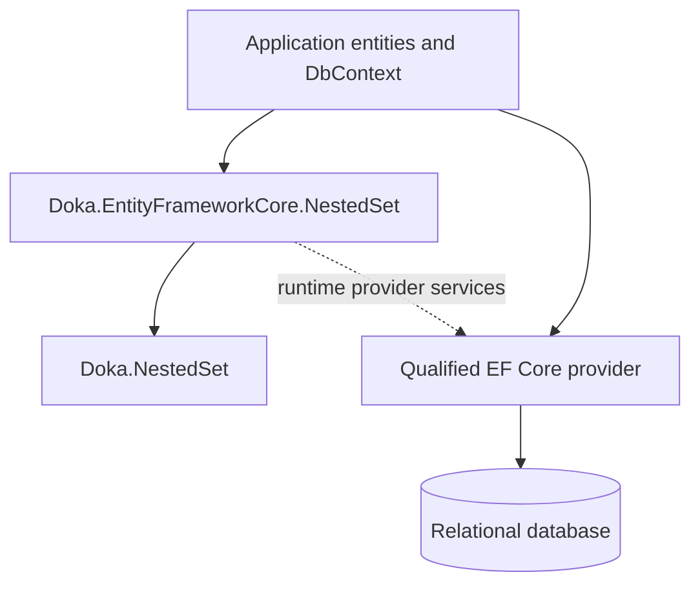
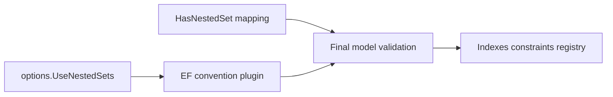
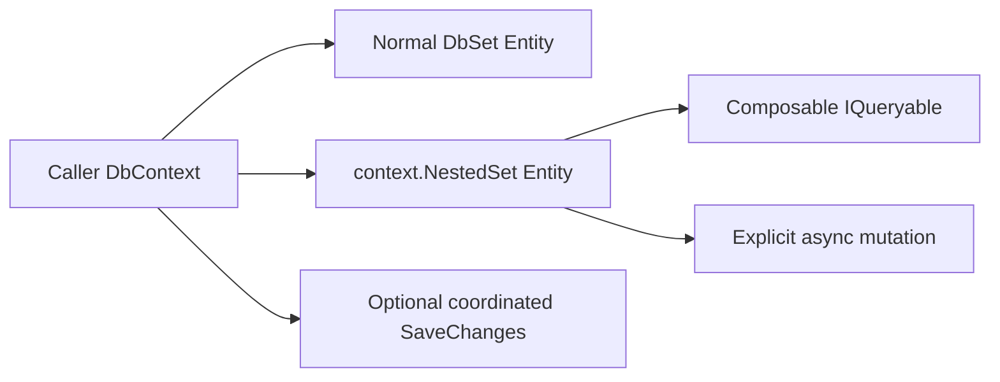
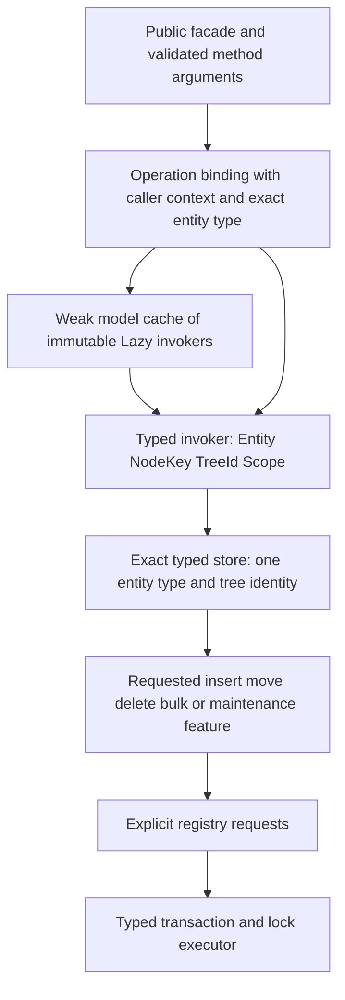
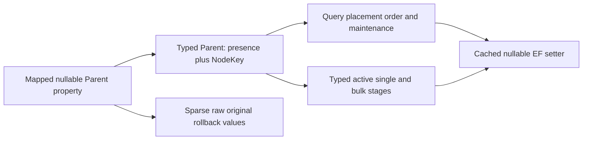
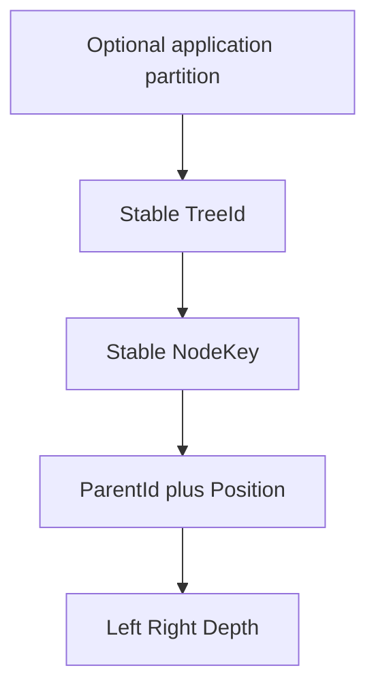
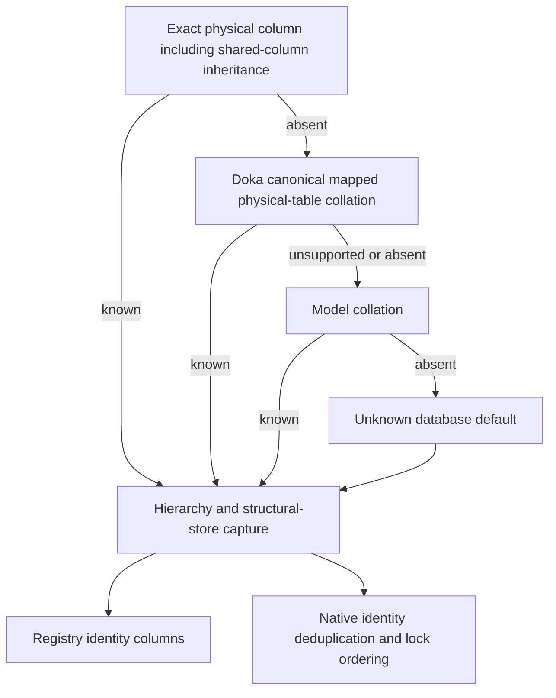
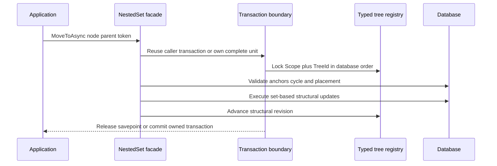
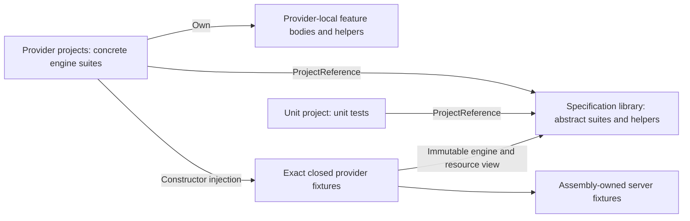

# Implementation design

NestedSet is a two-package library with one relational execution engine. The
public EF package extends an application's existing model and `DbContext`; it
does not introduce a second unit of work or a domain container entity.

## Package boundaries

`Doka.NestedSet` contains optional entity contracts, bounds semantics, and pure
relationship predicates. It has no EF Core dependency.

`Doka.EntityFrameworkCore.NestedSet` owns model conventions, query composition,
set-based mutations, ordering, transactions, typed tree locks, migrations,
validation, rebuild, and diagnostics. The package uses the caller's context,
connection, transaction, execution strategy, interceptors, and authorization
decision.

## Registration and finalized model

`UseNestedSets()` installs the convention plugin, SaveChanges guard, and
relational persistence boundary in the EF internal service provider.
`HasNestedSet(...)` assigns structural roles on an ordinary entity, including
a scalar NodeKey, stable TreeId, optional Scope,
Parent, bounds, Depth, Position, and optional sibling order.

Final validation rejects incomplete, type-incompatible, keyless, or
non-atomically writable mappings before the application performs a hierarchy
operation. Immutable mapping descriptors are cached by finalized model
identity. No context instance or tenant value enters that cache, so context
pooling cannot retain one lease's state.

Finalization also captures effective identity collations for each configured
hierarchy's exact structural table. These owner-specific facets survive EF's
runtime metadata trimming and compiled-model generation. A supplied or compiled
model with incomplete older capture must be regenerated with the current
NestedSet conventions; runtime does not silently replace its comparison rules.

## Runtime facade

The ordinary `DbSet<TEntity>` remains the payload and tracking surface.
`context.NestedSet<TEntity>()` is a lightweight facade over the same model and
context. If Scope is configured, `ForScope(scope)` must bind it before any
query or mutation. Method arguments infer the configured NodeKey and TreeId
types and are checked against model metadata before SQL generation.

## Typed feature execution

Finalized metadata determines the configured NodeKey, Scope, and TreeId CLR
types. The binding checks public arguments, then uses an immutable
`NestedSetMutationInvoker<TEntity, TKey, TTreeId, TScope>` cached by
`IEntityType`. The weak-table cache stores a `Lazy` with
`ExecutionAndPublication`: concurrent misses may allocate competing wrappers,
but generic reflection initializes the winning invoker once. Cached objects
hold no context, scoped value, transaction, or feature instance.

Four-role runtime types consistently use `<TEntity, TKey, TTreeId, TScope>`.
Generic virtual facade methods keep scalar arguments typed. Once the public
role checks succeed, the override selects the requested closed specialization's
static feature core. These cores are stateless, so dispatch needs no invoker
cast or per-operation adapter. NodeKey, TreeId, and Scope values remain typed
between facade and feature.

`ForScope(...)` allocates one private typed Scope carrier for the binding and
captures its independent value snapshot. The invoker casts that carrier's
reference to read the exact mapped Scope; the scalar remains typed. Unscoped
bindings need no carrier, and neither carrier nor bound value enters the
immutable model cache.

The invoker constructs only the requested feature and its consumed helpers.
`NestedSetStore<TEntity, TKey, TTreeId, TScope>` requires
`(context, entityType, scope, treeId)`; it has no scope-wide mode or optional
tree identity. The store captures identities through their EF comparers and
uses typed TreeId expressions in structural reads. Features share storage,
mapping, and execution primitives rather than a second forwarding service.
NodeKey arguments are captured before asynchronous discovery. Converted
mutable identities use their configured snapshot; binary identities always
receive an independent copy.

Parent is `NestedSetParent<TKey>`, an inline pair of `HasValue` and `Value`.
Presence is separate from the key's default value, so an assigned parent key
of `0` or `Guid.Empty` remains a real parent. Structural projections retain
the mapped nullable Parent property type while constructing this carrier;
querying, placement, updates, reorder planning, validation, and active insert
stages use the typed value. A cached bridge writes the mapped nullable Parent
type at the EF expression boundary. Converted custom key structs do not need
equality operators merely to participate in a mapped query. A required NodeKey
with nullable CLR storage retains its actual Parent type; the bridge does not
construct a second Nullable wrapper around it.

Active stages snapshot their typed identities before asynchronous work and
detect callback changes using the configured comparison contract. Sparse
`NestedSetBulkPlan.OriginalStructure` snapshots preserve the detached input's
raw null, sentinel, and non-sentinel values for rollback. They are not active
operation state. Likewise, a managed Parent change keeps its original raw
property value while its destination parent stays typed. Normalizing these
rollback values to non-null runtime identities would prevent exact restore.

`NestedSetMutationExecutor<TEntity, TKey, TTreeId, TScope>` consumes these same
types and the exact finalized entity mapping. Provider-equal tracked identities
are rejected before SQL. Remaining tracked NodeKeys are checked against the
locked trees through native predicates, then the tracker is checked
again before structural writes. This distinguishes native aliases from
application comparers that equate different stored trees.

Qualified native NodeKeys use the provider's collection parameter transport
per captured Scope group, with at most 64 requested trees in each predicate.
The SQL predicate still constrains the group's Scope. Unsupported or converted
keys use batches of at most 64 candidate keys. Grouping never separates Scope
from NodeKey, so repeated keys in different tenants cannot create false
membership. The [performance guide](performance.md) explains the resulting
command and allocation costs.

A temporary observer rejects hierarchy attachments during lock acquisition,
including an initially empty hierarchy tracker. That empty path adds only a
pending-state counter check, without another query or full detection pass.

An unscoped model closes shared generic code with the internal
`NestedSetNoScope` marker. This does not create a mapped property, require
`ForScope(...)`, or expose another public generic argument. Metadata dispatch
is an implementation choice: EF Core supports the typed property expressions
and comparer contracts but does not require this facade design.

Erased values are limited to EF's non-generic metadata and snapshot interfaces,
sparse rollback values, and a heterogeneous registry view. They do not replace
the typed TreeId held by a store. Typed forest requests pass
directly to the bulk planner; no intermediate array copies their identities
into an erased request model.

`NestedSetTreeLockRequest<TTreeId, TScope>` preserves typed identity and an
explicit lifecycle mode. Typed executors accept only requests for their exact
mapping. The non-generic lock coordinator views requests heterogeneously when
one coordinated save spans several hierarchies; this is the sole erased
registry identity boundary needed for shared database ordering.

[D-012](decisions/D-012-typed-tree-runtime.md) records the alternatives, exact
boundaries, official sources, and confirmation procedures.
The [regression matrix](regression-coverage.md) links these invariants to
positive, negative, and adversarial tests without claiming universal coverage.

## Identity and persisted structure

Scope, TreeId, and NodeKey have separate roles:

Without Scope, TreeId alone identifies a tree. With Scope, `(Scope, TreeId)` is
the complete identity. Every tree has exactly one root and its own local bounds
from `1` through `2 * nodeCount`; unrelated trees may therefore carry identical
bounds safely.

Parent and Position are the repairable adjacency source. Left, Right, and Depth
are the materialized nested-set read model. A cross-tree move changes TreeId on
the complete subtree in the same transaction. A cross-Scope move is rejected.

A scoped parent relationship uses a `(Scope, NodeKey)` principal key. If it
is missing, finalization adds it as an alternate key. With inheritance, that
key is declared on EF's root entity metadata while the concrete hierarchy
remains the self-FK's principal entity type. The existing primary key and
restrictive parent deletion are preserved; root metadata ownership does not
merge concrete TPC stores or their collations.

## Physical identity comparisons

Collation resolution follows the actual structural store, including physical
column overrides and shared-column inheritance. Canonical table metadata is
consumed only through explicit provider capability wiring. Doka's supported
physical-table collation takes precedence over the model default; private
provider migration annotations are not copied. Only absent applicable
metadata leaves the database default unknown. With the current conventions,
runtime reads the captured owner facets without schema queries or
per-operation metadata scans.

Applicable owners include explicit split fragments and retain the original
mapped type while TPT visits ancestor tables; TPH and TPC stop at their own
mappings. A leaf's canonical table declaration can therefore apply to its
ancestor structural store through Doka's original-owner metadata. Resolving
only the CLR entity's current table would confuse structural and payload
stores.

When multiple applicable owners declare different table default values for the
same physical identity column, NestedSet rejects that ambiguous configuration.
Doka itself selects the first annotated mapped owner. This narrower library
validation keeps identity independent of visitation order; an explicit column
collation overrides the table declarations before ambiguity is checked. TPT,
TPC, table splitting, and entity splitting remain supported mapping shapes.

An inherited property can be shared by two concrete TPC tables with different
collations. Capturing one value on that property would conflate their physical
identities, so capture belongs to each hierarchy owner and its resolved store.
Registry columns and native identity rowsets use the same effective facets.
Concrete TPT bindings normalize to their configured ancestor owner for query,
mutation, and coordinated-save comparisons. This does not merge independent
concrete TPC hierarchies that merely share an inherited property object.
Captured string facets serialize on the hierarchy owner, including an empty
string for a genuinely unknown default. A missing owner facet requires model
regeneration and cannot silently mean the same thing as that empty capture.
Case-distinct binary Scopes can therefore share one TreeId without a registry
silently merging their identities through another default collation.

The tracked-membership guard also preserves the separate MySQL equality-folding
boundary described in [D-012](decisions/D-012-typed-tree-runtime.md). Its internal
typed candidate Scope marker translates to the column-native STRCMP comparison
on MySQL/MariaDB string provider representations; the indexed request equality
and key transport remain unchanged. This protects known collations and
genuinely unknown database defaults without guessing or discovering a server
collation. PAD SPACE aliases remain aliases, while NO PAD identities retain
their distinct trailing spaces.

## Query engine

Public hierarchy queries are deferred, no-tracking `IQueryable<TEntity>`
expressions rooted in the application's entity set. `TreeContaining(nodeKey)`,
`SubtreeOf(nodeKey)`, `AncestorsOf(nodeKey)`, and the other anchor queries use a
database join against the visible anchor; callers do not load the anchor first.
Tree identity and boundary predicates expose the configured indexes to the
database planner. Direct parent and child queries join mapped ParentId and
NodeKey using the principal key's database comparison. These query shapes use
relational joins rather than requiring SQLite to support `APPLY`.

Result queries retain global query filters. Internal structural reads ignore
those filters so a hidden node cannot produce incomplete interval arithmetic,
then reapply the mandatory Scope and TreeId predicates owned by the library.
Preorder is the persisted Left order. Additional application predicates remain
composable before materialization.

## Mutation and lock protocol

Each hierarchy owns an internal registry whose Scope and TreeId columns copy
the source store types, converters, facets, and collations. The database sorts
complete identities before multi-tree acquisition. Writers of one tree
serialize; writers of independent server trees do not pass through a global
library lock. SQLite preserves the same contract through its database writer
semantics.

An existing application transaction remains caller-owned and uses a savepoint.
Without one, the library owns the complete transaction. A retrying execution
strategy may retry only the complete application unit. Cleanup uses
`CancellationToken.None` after forward progress fails so an already canceled
token cannot skip rollback.

Single-node inserts, moves, and deletes use set-based range updates. The client
does not materialize every shifted node. The package rejects affected tracked
hierarchy entities before an explicit set-based mutation so the change tracker
cannot retain stale structure.

The executor receives explicit requests for new or existing registry
identities; it never discovers scope-wide trees as a fallback. Consistent
validation and rebuild planning have a separate read-lock path. That path
locks the exact inspected tree while preserving pending tracked changes and
performs no EF save or structural write. Coordinated parent changes execute
under their already acquired locks rather than creating another executor for
each node.
Tracked refresh captures are constructed directly with the known identity
types after native membership resolution, with every required field populated.

## Ordering and coordinated saves

Configured sibling order is stored in model metadata and translated with the
provider's store comparison. NodeKey is the final deterministic tie breaker.
Insert, move, rebuild, and automatic reorder therefore use the same database
semantics for direction, null order, conversion, and collation.

The SaveChanges guard rejects uncoordinated Parent, TreeId, Scope, or ordering
changes before payload SQL. Explicit mutations reject changes already recorded
as pending before the first identity lookup. After an awaited scalar lookup,
execution checks the tracker again before locks or writes because a command
interceptor can change it during that await. When automatic detection is
enabled, this check also discovers ordinary CLR edits not recorded earlier.
The affected-tree check reuses that detected state without a third detection
pass.

`NestedSetDbContext` or
`SaveNestedSetChangesAsync(...)` composes the application's existing save rule
with one coordinated transaction: capture changes, lock affected source and
target trees, save payload once, apply planned structural changes, refresh
tracked structure and store-generated tokens, then accept changes.

## Bulk import, validation, and rebuild

Bulk import validates detached input and topology before its first write. It
uses iterative traversal, compact planning buffers, deterministic multi-tree
lock order, and bounded 64-entity EF insertion batches. Each forest root has an
explicit TreeId. Write batches span independent trees, so 131 one-node trees
use three payload saves while still locking every identity before payload SQL.
A failed write restores captured CLR structural values where
the outcome is definite.

Quick validation uses indexed aggregate and local invariant queries. Full
validation loads compact structural projections and traverses iteratively.
`PlanRebuildAsync` is write-free. `RebuildAsync` locks exactly one tree, rejects
invalid adjacency before its first update, and writes only changed structural
rows in bounded batches.

## Registry lifecycle and administrative purge

Deleting the complete root or calling `DeleteTreeAsync` changes the registry
identity from active to tombstoned in the same transaction. The tombstone
prevents accidental reuse after a delete, delayed message, or retry.

`PurgeTreeIdAsync` is a separate administrative operation. It locks the exact
tombstone, verifies through an unfiltered Scope-and-TreeId query that no nodes
remain, and deletes exactly that registry row. It rejects missing identities,
active trees, unsupported lifecycle values, and tombstones that still own
nodes. After commit, deliberate reuse is possible. The application owns
authorization, audit retention, and the decision that no external reference
still depends on the retired generation.

## Provider boundary

Provider capabilities isolate lock SQL, required isolation, identifier quoting,
set-update details, self-referential delete behavior, and store-specific order.
All value parameters come from finalized relational type mappings. Physical
identifiers come only from trusted model metadata and the provider SQL helper.

The common contract is qualified for Doka MySQL/MariaDB, Npgsql PostgreSQL,
Microsoft SQLite, and Microsoft SQL Server. Pomelo is outside the contract.
Ordinary EF migrations are the required baseline; SafeMigrations is optional.

## Diagnostics boundary

Explicit mutations, coordinated saves, validation, and rebuild execute inside
the package telemetry boundary. Activities and metrics expose bounded
operation, outcome, provider family, failure class, duration, lock wait, rows
affected, batch count, and rebuild node count.

NodeKey, Scope, TreeId, entity or table names, SQL, connection data, exception
messages, and payload are never emitted as library tags. When no listener is
enabled, the operation task passes through without an additional async state
machine. Deferred query execution remains visible through EF Core diagnostics.

## Source layout

| Area | Responsibility |
| --- | --- |
| `src/Doka.NestedSet` | EF-independent optional contracts and pure semantics |
| Package root | Public context, query, and mutation entry points |
| `Features/Insert`, `Features/Move`, and `Features/Delete` | Single-node and subtree mutations |
| `Features/BulkImport` | Bounded forest planning, insertion, and refresh |
| `Features/Queries` and `Features/Facade` | Composable tree queries and the mutation facade |
| `Features/Ordering` and `Features/ManagedSave` | Sibling order and coordinated SaveChanges |
| `Features/Maintenance` | Registry lifecycle, inspection, repair, and rebuild |
| `Configuration` and `Mapping` | Structural roles, conventions, and finalized immutable metadata |
| `Execution` and `Providers` | Transactions, tree locks, retries, and provider capabilities |
| `Storage` and `Shared/Structural` | Typed relational access and structural primitives shared by features |
| `Diagnostics` and `Errors` | Bounded telemetry and stable failure codes |

The public namespace stays `Doka.EntityFrameworkCore.NestedSet` regardless of
the source folder. The internal feature namespaces reflect ownership; shared
storage, mapping, and transaction code remains outside the feature folders
because multiple operations consume it. The split is organizational: it does
not add a project, a service registration, or a per-operation handler.

[D-011](decisions/D-011-feature-oriented-source-layout.md) records the runtime
source layout.

## Test project ownership

All test projects sit directly under the solution's `tests` folder. The
`Doka.EntityFrameworkCore.NestedSet.Specification.Tests` project compiles the
common integration assertions, models, and reusable infrastructure once. It is
a non-runnable, non-packable library. Its common test suites are public abstract
classes, including nested suites; they are not independently discovered tests.

The four provider projects reference that library and own thin concrete
subclasses for every common suite and engine. xUnit discovers inherited methods
on those concrete classes. The MySql project contains separate same-named MySQL
and MariaDB suites; MariaDB wrappers live under its `MariaDb` folder and namespace.
PostgreSql, SqlServer, and Sqlite own their respective engines. A suite remains
structurally owned even when a justified method exclusion leaves that engine
with no executable methods. A common method and every scenario variant must
span more than one executable provider project after combining method and row
exclusions. MySQL and MariaDB share one executable for this ownership rule.
Provider-exclusive test bodies and helpers live in that project. Models and
test-free support retain their common identity only where shared and local
consumers actually need it. Unit tests own their test bodies and reference the
specification library for shared infrastructure. No project compiles linked
copies of common sources. Ordinary migration and optional SafeMigrations
qualification remain separate.

`NativeGuardProbe`, `ScaleProbe`, and its shared `ScaleCommand` observation are
independent internal helper types. Their shared and provider-local consumers
reference them directly without nesting dependencies or global aliases.
Suite-private observers stay private. Moving a command probe does not change
its context correlation, subscriptions, disposal, or measurement boundaries;
existing context and entity CLR types retain their model and cache identities.
Provider-only files follow feature folders, including SQL Server tree-registry
tests under `Concurrency/TreeRegistry` and row-version tests under
`Ordering/Tracking/RowVersion`.

All providers keep wide registry-rowset tests in `Concurrency/TreeRegistry`.
SQL Server separates `WideRowsetLockTests` from `ScopeValidationTests`.
Its row-version suite, fixture, and context use the local names `RowVersionTests`,
`RowVersionFixture`, and `RowVersionContext`; the SQLite writer-timeout suite
uses `WriterTimeoutTests`. The row-version entity retains its
`SqlServerVersionNode` short name and explicit physical mapping. Provider-only
model and support files use their provider namespace. These namespace moves
intentionally change CLR and model-cache identity, while entity short names,
explicit physical tables, inheritance mappings, and existing measurement
warmups remain intact. Fresh builds and model tests qualify the changed identity.

`QueryPlanTestSupport` owns shared asynchronous evidence writing independently
of any query-plan suite. All six existing call paths use it directly, preserving
the configured output directory, file names, spacing, and cancellation behavior.

Common suites are nongeneric and accept an `IProviderFixture<TResource>` view in
a protected constructor. Each concrete leaf exposes one public constructor with
the exact registered `ProviderFixture<TResource, TEngine>` specialization and
forwards it to the shared constructor. That fixture exposes immutable `Engine`
and `Value`, constructs the existing resource once, and forwards asynchronous
initialization and disposal at its registered lifetime. Shared methods obtain
`Engine` from this fixture instead of theory arguments or ambient assembly state.
Metadata-only suites use `ProviderResources`; discovery and structural audits
read the concrete fixture type without constructing database resources.

Ordinary `Fact`, `Theory`, `InlineData`, and `MemberData` are the common default:
every concrete engine runs the same engine-neutral scenario arguments.
`EngineFact` and `EngineTheory` express method exclusions with exact engine names
and a nonempty reason. `EngineInlineData`, `EngineMemberData`, and
`EngineTheoryDataRow` retain justified variant exclusions. Excluded methods are
omitted before fixture construction; excluded rows are filtered when xUnit
enumerates their source. Unexpected empty data is a visible failure, not a skip.
Discovery does not pre-read member factories to decide eligibility and then
enumerate them again. Existing scenarios remain preserved while common cases
previously limited by arbitrary engine sampling run on all concrete engines.

Fixture-owned provider-local suites use ordinary fact and theory annotations
with engine-neutral scenario data. The actual leaf's exact closed fixture
supplies engine ownership. MySQL-family bodies and exclusive helpers compile
once in local abstract feature suites; separate MySQL and MariaDB leaves supply
their exact fixtures. Each of the seven local families has one `*TestBase.cs`
file and one type per concrete leaf file. Existing named collection declarations
sit explicitly on the leaves. The `ScopeAliasRowset` family retains class-owned
fixtures and has no named collection; consistent source layout does not alter
its resource lifetime. A MySQL-only NO PAD test is declared only on the MySQL
leaf. Local suites do not inherit common test-bearing suites and therefore do
not execute retained common cases a second time.

The local guard audits effective inherited methods whose declaration belongs
to the executing provider assembly, including abstract family declarations.
It keeps common-library declarations under the separate shared-contract guard.
Scenario strings, even engine-looking strings, are payload rather than engine
selectors. An ordinary local `MemberData` source retains its explicit
`MemberType`; an unset value resolves through the concrete leaf and its base
types, matching xUnit's public metadata initialization.

All local suites follow this fixture-owned contract. The former `Provider*`
attributes, their discoverers, and legacy row-selection guard branches are
removed. `ProviderEngineOwnership` retains one known-engine and executable
catalog containing each engine's exact name, marker type, and executable.
Known-engine checks, executable membership, owned-engine enumeration, expected
closed model-collection fixture types, and the common-coverage executable count
derive from this immutable catalog. Its explicit assembly lookup serves
discovery and metadata guards;
its ambient lookup serves current-assembly server and metadata checks. Neither
supplies the engine of a fixture-owned test. Missing or foreign fixtures,
engine-selector arguments on neutral cases, invalid inherited annotations,
empty sources, and exclusions that collapse a common variant to one executable
owner fail visibly.

Resolving an engine against the actual suite assembly does not validate a
separate assembly supplied by an audit caller. The local guard therefore checks
that the audit owner also owns the resolved engine. The redundant unknown-engine
branch is removed after engine resolution, while the foreign-audit-owner
regression retains this independent boundary. Custom fixture marker types still
resolve through their static engine name; the built-in marker catalog defines
expected registrations without imposing another marker-type restriction.

The five `ProviderAnnotationTests` methods inspect metadata once per executable.
Their explicit MariaDB exclusions explain that MySql audits the same assembly
inventory. Both sealed engine wrappers and the full MySQL/MariaDB owned-engine
set remain in that audit. Exactly five duplicate metadata cases disappear;
no database behavior scenario is omitted.

Each provider assembly registers its own `TestDatabaseServers` fixture and
public named collection definitions. The fixture starts containers lazily,
at most once per owned server engine, and disposes them after that assembly's
collections finish. A complete MySql run uses one MySQL and one MariaDB
container; PostgreSql and SqlServer each use one, and Sqlite uses none. Separate
assemblies do not share a static fixture singleton, even in one test process.
Database creation resolves the executing assembly's fixture asynchronously
from xUnit's current class or test context.

Server reuse and database reuse have different boundaries. The shared suites'
class or collection fixtures own their existing database resources. MySql's
`Model compatibility` collection registers both closed
`ProviderFixture<ModelCompatibilityDatabase, MySqlEngine>` and
`ProviderFixture<ModelCompatibilityDatabase, MariaDbEngine>` types. A common
model suite injects its exact collection fixture without a class registration
that would shadow it; the collection preserves its existing serialized reuse.
Provider-local model suites also inject their exact closed collection fixtures.
The unbound `ModelCompatibilityDatabase` collection registrations are removed
from MySql and SqlServer; each retained engine-bound fixture still creates and
owns its resource at the same collection lifetime. Individual tests may share
their fixture's database while isolating their data.
`ProviderCollectionFixtureContract` compares the complete set of
`ICollectionFixture<>` registrations with the catalog's exact expected set.
It rejects missing or foreign engine fixtures, wrong resources, restored bare
`ModelCompatibilityDatabase`, and unrelated registrations without constructing
resources. Filtering only recognized engine-bound fixtures would conceal extra
resources that xUnit initializes for a collection with an eligible case, even
when no test constructor requests them. Positive and negative metadata tests
protect this registration boundary separately from constructor injection.
The `Allocation measurements` collection retains disabled parallelization.
Its definition is local to every consuming executable assembly, including Unit;
a metadata guard rejects a missing or duplicated local named collection.
This preserves the current isolation and parallelism contract without claiming
one database per test.

The constructor guard uses public xUnit metadata for the actual concrete class
and its resolved collection and assembly. It models exact fixture lookup,
including supported generic registration normalization, along the class,
collection, and assembly parent chain. Test constructors may also receive the
exact `ITestOutputHelper` or `ITestContextAccessor` interfaces, or use xUnit's
default, optional, and parameter-array fallbacks. Nullable annotations or an
assignable registered type do not satisfy an unresolved required parameter.

Fixture constructors have a separate contract: they receive `IMessageSink`,
`ITestContextAccessor`, or a fixture from a parent scope. Same-level dependencies
and test-constructor fallbacks are not fixture-constructor support. The guard
checks these dependencies even for registered fixtures unused by the test
constructor. Positive and negative regressions cover inherited registrations,
named and type-based collections, nested-class boundaries, missing exact
registrations, and constructor shape without initializing resources. This
contract is scoped to the repository's ordinary reflection-based xUnit runner.

[D-013](decisions/D-013-provider-owned-integration-test-projects.md) records the
referenced specification strategy, the previous linked-source option, and its
discovery and fixture confirmation procedures.
