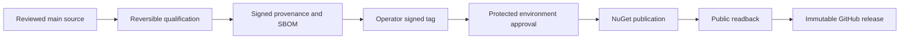

# Release governance

This document defines who may decide, qualify, authorize, and verify a release.
The executable contract is in [Release process](release-process.md); exact
commands are in [Release publication](operations/release-publication.md).

## Roles

| Role | Responsibility |
| --- | --- |
| Change author | Prepares source, tests, docs, changelog, API baselines, and local evidence |
| Reviewer | Reviews the current change head and applicable evidence |
| Project owner | Selects version, accepts compatibility impact, and authorizes publication |
| Release operator | Runs preflight, dispatches the exact candidate, creates the signed tag, approves the protected job, and monitors readback |
| Security reporter/reviewer | Uses the private process and does not place embargoed details in release artifacts |

One person can currently hold several roles, but each action remains explicit.
Documentation does not claim independent review or continuity that repository
history and organization access do not demonstrate.

## Version policy

Both package IDs publish one identical canonical version:

- `Doka.NestedSet`;
- `Doka.EntityFrameworkCore.NestedSet`.

Accepted release versions are `X.Y.Z-rc.N` and `X.Y.Z`, without a leading `v`
or build metadata. The source tag is `v<version>`. NuGet versions are never
reused or repointed.

An RC communicates a candidate public contract. A stable release communicates
the reviewed stable contract and moves the public API additions from
`PublicAPI.Unshipped.txt` to `PublicAPI.Shipped.txt` in the source commit before
qualification.

For the first stable `10.0.0`, the accepted Core and EF declarations are in
their shipped files and both unshipped files contain only the nullable
directive. The source version is `10.0.0` without a prerelease suffix.

## Entry conditions

- Exact source is reviewed and current on protected `main`.
- Worktree is clean and dependency locks match source.
- Version and dated changelog entry are reviewed.
- Both package IDs are unused at that version.
- Public API baselines and compatibility impact are correct.
- Required provider, migration, package, SBOM, and consumer checks pass.
- No unresolved security or data-integrity blocker applies.
- Hosted repository, environment, trusted publisher, signer, and immutable
  release settings have been read back.

The absence of an existing tag is required before qualification. The tag is
created only after all reversible candidate work succeeds.

## Separation of stages

The release operator must be able to inspect candidate hashes and retained
evidence before creating the tag or approving the protected environment.
Environment approval authorizes the exact waiting run only.

## Required evidence

The release record includes:

- source commit, tree, and content fingerprint;
- workflow run and attempt;
- candidate and package manifests;
- primary and symbol package SHA-256 hashes;
- locked dependency evidence;
- full test and provider results;
- package-only consumer results;
- per-package SPDX 2.2 SBOMs;
- portable provenance and SBOM attestation bundles;
- signed annotated tag verification;
- staged and final GitHub release readback;
- NuGet repository signature and canonical-content readback; and
- symbol/Portable PDB readback.

Local benchmark timings are not release evidence. GitHub runner hardware is not
a deterministic performance baseline.

## Failure policy

Any missing, stale, duplicate, extra, malformed, or conflicting identity
artifact fails closed. Do not rebuild selected files, copy evidence from
another run, move a tag, delete and reuse a published version, disable package
signature checks, or approve a different run as a substitute.

NuGet publication across two package IDs is not atomic. Recovery uses only the
same failed publish job and candidate. Already visible matching packages may be
skipped; conflicting public content is terminal. The GitHub release remains a
draft until public packages are verified.

## Security fixes

Coordinate embargoed releases through the private channel in
[SECURITY.md](../SECURITY.md). Public changelog and release notes must not reveal
an exploitable detail before the coordinated disclosure point. The same
artifact, signing, approval, and readback gates still apply unless an explicit
incident decision records a necessary deviation and its compensating control.

## Post-release review

After publication:

1. verify the public tag, assets, provenance, SBOMs, packages, signatures, and
   symbols independently;
2. confirm stable/prerelease and latest flags;
3. archive exact run and attempt links in the release record;
4. update support/changelog statements that depend on actual availability; and
5. open findings for every manual recovery or unexpected warning.

A workflow success without public readback is an incomplete release.
