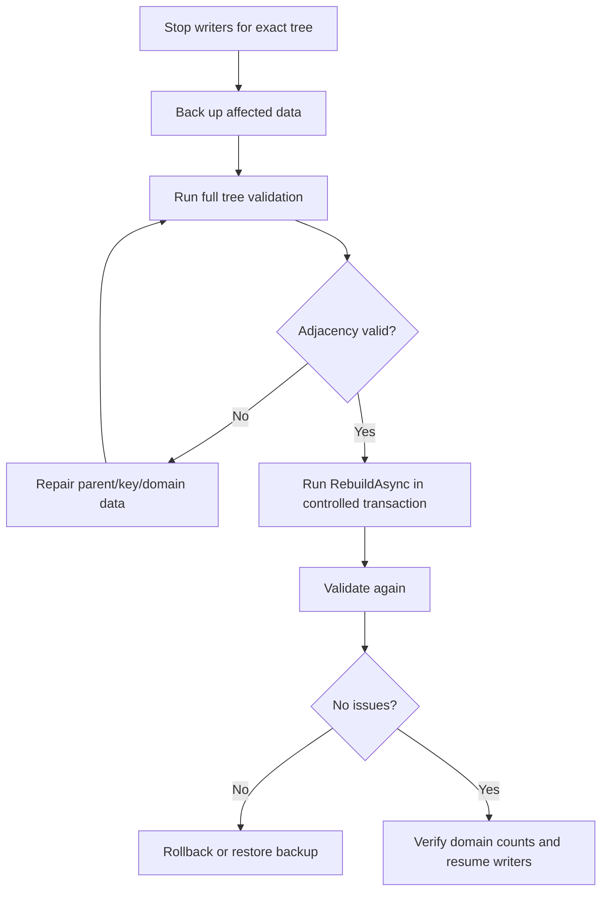

# Deployment and recovery runbook

This runbook owns operational preparation, diagnosis, and recovery for a
NestedSet deployment. It assumes the application already has database backup,
restore, monitoring, and change-management procedures.

## Before deployment

Record:

- application and NestedSet package versions;
- EF Core and provider versions;
- exact database engine version and topology;
- generated migration identity and reviewed SQL;
- hierarchy tables, optional Scope columns, and typed tree-registry tables;
- expected tree count and largest-tree size;
- backup/restore point and rollback owner; and
- the application maintenance or write-drain procedure.

Apply the migration to an empty database and an upgrade fixture first. Confirm
the structural columns, derived index roles, parent delete behavior, typed
registry identity, and provider-specific collations.

Run a smoke scenario on the target configuration:

1. insert two TreeIds in one Scope and the same TreeId in another Scope, all
   with repeated bounds;
2. query a complete tree from a descendant;
3. filter ancestors by a domain property;
4. move a subtree and verify depth and position;
5. rename an automatically ordered node through `SaveChangesAsync`;
6. delete one node with child promotion;
7. roll back hierarchy plus domain data in one caller transaction; and
8. run `InTree(treeId).ValidateAsync(NestedSetValidationLevel.Full, token)`
   for every smoke tree.

Do not enable writers when the migration or validation result is uncertain.

## Incident evidence

Before attempting repair, capture:

- UTC time window and application correlation IDs;
- package, provider, engine, and schema versions;
- exact `NestedSetErrorCode` or provider error;
- transaction ownership and whether commit acknowledgement was received;
- complete Scope and TreeId identity in a protected incident record;
- lock-wait and operation metrics without adding sensitive tags;
- database deadlock/lock-timeout evidence and relevant query plans;
- tree-bound full validation reports; and
- recent migration, direct SQL, trigger, or maintenance activity.

Do not paste production identifiers, credentials, paths, user data, or role
assignments into public issues.

## Routing table

| Symptom | Immediate action | Next evidence |
| --- | --- | --- |
| Migration fails | Stop rollout; preserve migration SQL and provider error | Physical catalog and migration history |
| `TreeNotFound` | Stop the command; reconcile node rows and the exact typed registry identity | Migration and registry lifecycle evidence |
| `TreeIdUnavailable` | Select a genuinely new identity or reconcile the active/tombstoned tree | Registry lifecycle evidence |
| `TreeIdNotTombstoned` | Stop purge; the selected identity is active | Tree contents and registry lifecycle evidence |
| `ConcurrentTreeIdentity` | Reload the anchor in a new read and re-evaluate the requested mutation | Original and current TreeId within the same Scope |
| `InvalidStructure` | Stop hierarchy writers for the affected tree | Full validation and recent writer inventory |
| Deadlock or lock timeout | Allow failed transaction to roll back; do not weaken locking | Lock graph, transaction duration, global lock order |
| Commit exception/connection loss | Treat outcome as unknown | New-context read by stable application identity |
| Cross-scope result | Treat as a security and integrity incident | Minimal query/mapping reproducer and affected versions |
| Slow mutation | Preserve correctness; compare command/row counts and plan | Scope shape, indexes, statistics, lock wait |
| Ordered save rejected | Stop retry loop; inspect context integration and sync/async path | Tracked entries and save override |
| Bulk restoration fails | Discard context | Original and restoration exceptions plus database state |

## Registry growth and controlled TreeId purge

Tombstones are retained by default because they prevent a delayed command from
silently creating a new logical tree under an old identity. Registry growth is
therefore expected to follow the number of deleted or merged trees.

Before purging one identity:

1. authorize the administrative action separately from ordinary tree writes;
2. preserve the complete Scope and TreeId in a protected audit record;
3. prove that application retention and external-reference rules permit reuse;
4. confirm no delayed command, message, cache entry, or backup workflow can
   still address the retired generation;
5. call `PurgeTreeIdAsync(treeId, cancellationToken)` through a fresh context;
6. record the transaction outcome and the operator identity; and
7. query the registry and hierarchy through a new context before permitting
   reuse.

The operation locks the exact tombstone and independently verifies that no
hierarchy node remains, including nodes hidden by application query filters. It
rejects missing identities, active rows, unsupported lifecycle values, and a
damaged tombstone that still owns nodes. Do not delete registry rows with raw
SQL. A failure preserves the tombstone for investigation.

If commit acknowledgement is lost, treat the purge outcome as unknown. A fresh
context must determine whether the tombstone remains before any reuse attempt.

## Unknown commit outcome

Never retry the same command automatically after a commit acknowledgement
failure.

1. Dispose the failed context and connection.
2. Open a new context.
3. Locate the command through an application idempotency/audit identity.
4. Read the hierarchy and related domain rows.
5. Validate every affected exact tree.
6. Determine whether the intended final state exists.
7. Complete, compensate, or retry as a new explicit command.

If the application lacks a stable command identity, record that operational
gap. NestedSet cannot infer whether external side effects belong to the same
logical command.

## Structural corruption

Stop all hierarchy writers for the affected tree. Direct SQL and secondary ORM
writers must stop as well.



`RebuildAsync` repairs bounds, depth, and position from adjacency. It cannot
repair missing parents, cycles, duplicate keys, or an incorrect business
parent. Never delete validation failures merely to let rebuild proceed.

Retain before/after counts, validation issues, repair commands, transaction
result, and operator identity in the application's incident system.

## Lock contention and deadlocks

Check:

- whether transactions include remote calls or user interaction;
- whether application tables and tree-registry locks are acquired in one global
  order;
- whether most writers target one hot TreeId;
- whether every writer uses the NestedSet tree-registry protocol;
- whether SQLite's expected single-writer boundary is being exceeded; and
- whether missing indexes or stale statistics widened locked scans.

For MariaDB 11.8, inspect the live lock graph while the wait is active:

```sql
SELECT locked_table, locked_index, waiting_lock_mode, blocking_lock_mode,
       waiting_pid, blocking_pid
FROM sys.innodb_lock_waits;
```

The [MariaDB lock-wait view](https://mariadb.com/docs/server/reference/system-tables/sys-schema/sys-schema-views/innodb_lock_waits-and-xinnodb_lock_waits-sys-schema-views)
distinguishes a typed tree-registry wait from contention on the node table's
primary, alternate, or foreign-key index. In the latter case, different
TreeIds do not imply independent physical index locks. Check recently reused
node keys and long-lived MVCC readers before changing the tree-lock protocol.
Keep raw query text and identifiers in the protected incident record.

Fix the root cause. Do not bypass the registry lock, split one mutation into
independently committed statements, or lower correctness isolation to hide the
symptom.

## Migration recovery

If a migration fails before application traffic:

1. stop the deployment;
2. inspect migration history and physical catalog independently;
3. determine which statements committed under the provider's DDL behavior;
4. restore or apply a reviewed forward repair;
5. re-run the migration lifecycle from a known fixture; and
6. repeat the deployment smoke and validation.

Do not mark migration history manually until the physical schema exactly
matches the migration. SafeMigrations is optional and has its own rejection and
replay contract; identify whether the ordinary or optional path produced the
failure.

## Performance regression

Reproduce on controlled hardware before calling a timing change a product
regression. Compare source/package bytes, engine/provider versions, schema,
indexes, statistics, data shape, command count, affected rows, lock wait, and
actual plan.

Paired measurements require a controlled environment. Hosted runner timing
is not an acceptance baseline. See [Performance and capacity](../performance.md).

## Resume criteria

Resume hierarchy writers only when:

- migration and catalog match the reviewed model;
- the transaction outcome is reconciled;
- full validation is clean for every affected tree;
- domain row counts and representative relationships are correct;
- the writer/lock configuration is consistent; and
- the incident owner has recorded the cause, repair, and recurrence guard.

A successful rebuild without a known cause is not sufficient. Preserve a
regression test or operational control that detects the failure mode earlier.
