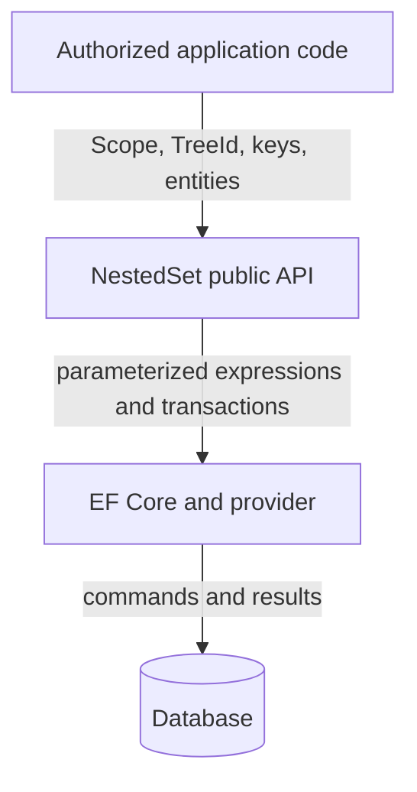

# Security design

This document is the repository threat model and secure-design contract for
`Doka.NestedSet` and `Doka.EntityFrameworkCore.NestedSet`. Report suspected vulnerabilities through [SECURITY.md](../../SECURITY.md),
not a public issue.

## Security objectives

NestedSet must:

- keep every query and mutation inside its complete Scope and TreeId boundary;
- preserve hierarchy integrity across failure and concurrent writers;
- parameterize runtime values and identifiers through validated model metadata;
- reject unsupported or ambiguous mappings;
- avoid exposing application identifiers or payload through library telemetry;
- compose safely with caller-owned transactions.

The library does not authenticate users, authorize a Scope or TreeId, define role or
privilege inheritance, encrypt database traffic, manage database credentials,
or protect backups. Those controls belong to the application and deployment.

## Assets

- hierarchy Scope, TreeId, parent, bounds, depth, and position integrity;
- application payload and relationships attached to nodes;
- tenant and authorization-boundary separation;
- database connection and transaction state;
- vulnerability reports and operational evidence.

## Trust boundaries

Every arrow crosses independently administered code or infrastructure. A
passing check on one side does not make data on the other side trusted.

## Threats and controls

### Cross-tree or cross-Scope access

**Threat.** A key or bound from one tenant causes reads or writes in another.

**Controls.** A scoped facade binds one non-null Scope. Anchor queries resolve
TreeId and bounds in the same database expression, and every result predicate
uses both values. Explicit tree queries bind TreeId directly. Tests repeat
keys, TreeIds, and bounds across independent partitions. Scope and TreeId
selection still require application authorization.

### Structural corruption through concurrency

**Threat.** Two writers interleave gap shifts or moves and produce overlapping
or missing coordinates.

**Controls.** One transaction covers the mutation. A typed registry row
serializes writers for one exact tree. Cross-tree operations acquire registry
rows in database order. Savepoints isolate failures in caller transactions.
Validation and rebuild provide detection and repair from explicit adjacency.

**Residual risk.** Direct SQL, triggers, or another ORM that bypasses the lock
can corrupt the structure. The operator must coordinate every writer.

### Injection and identifier confusion

**Threat.** Scope/key/payload values or mapped identifiers alter SQL meaning.

**Controls.** Values remain EF parameters. Identifiers come from finalized EF
relational metadata and provider quoting, not caller strings. Mapping selectors
must be direct properties. Registry identities use the mapped Scope and TreeId
store types, converters, facets, and collations.

**Residual risk.** Application raw SQL and provider defects remain outside the
library. Use least-privilege database accounts and review generated migrations.

### Unauthorized hierarchy changes

**Threat.** A caller uses a valid facade for a Scope, TreeId, or operation it may not
access.

**Controls.** The library makes Scope and TreeId explicit and does not present
them as authorization mechanisms. Applications must authenticate and authorize
before facade invocation. Examples keep role/privilege evaluation in
application code.

### Transaction confusion and duplicate effects

**Threat.** Partial statements commit, retries duplicate a logical command, or
a failed save leaves tracked state inconsistent.

**Controls.** The mutation executor owns begin/commit/rollback or a savepoint.
A retrying execution strategy is accepted only while its active delegate owns
the complete caller transaction and related domain writes. Incompatible retry
or transaction state is rejected. Cleanup is not canceled with the forward
token. Commit-unknown failures require application reconciliation. Managed
structure is refreshed or restored within the documented boundary.

### Denial of service

**Threat.** Very large trees, deep imports, lock contention, or adversarial
queries consume CPU, memory, rows, or transaction time.

**Controls.** Query APIs remain composable; mutations use set-based SQL; tree
traversal is iterative; structural indexes are generated; typed per-tree locks
permit independent server writers; cancellation is propagated. Bulk,
validation, and rebuild document their linear memory boundary.

**Residual risk.** The application must limit request size, authorize
maintenance operations, set provider timeouts, and capacity-test its data
shape. The library intentionally has no universal node limit.

### Sensitive diagnostic disclosure

**Threat.** Metrics or traces expose tenant keys, user/group names, folder
paths, SQL, connection details, or exception payload.

**Controls.** Library signals use bounded constant operation, outcome, and
error classifications. They exclude scope, key, table/entity, SQL, messages,
and payload. Detailed validation returns keys only to the direct caller.

## Abuse cases

| Abuse case | Required response |
| --- | --- |
| Caller supplies another tenant's node key | Scope predicate yields no anchor; application authorization must reject the attempted Scope selection |
| Huge unauthenticated rebuild request | Application must restrict maintenance API and enforce resource/time limits |
| Writer changes bounds with direct SQL | Stop writers, preserve evidence, validate, repair adjacency or rebuild, and prevent recurrence |
| Attacker puts tenant ID in telemetry configuration | Application telemetry policy must reject high-cardinality/sensitive tags; library does not add them |

## Secure deployment requirements

- Authorize the requested Scope, TreeId, and operation before invoking NestedSet.
- Use TLS and credential policy provided by the database/provider deployment.
- Grant only required DML/DDL permissions to runtime and migration identities.
- Ensure every structural writer uses the same typed tree-registry protocol.
- Verify registry tables and identity mappings during migration deployment.
- Back up and test restoration before hierarchy migrations or bulk repair.
- Keep telemetry and incident evidence free of credentials and protected data.

## Review triggers

Review this model when:

- a provider, database family, package, or target framework is added;
- a new SQL construction or identifier path appears;
- transaction, lock, scope, retry, or SaveChanges behavior changes;
- telemetry adds a signal or dimension;
- a public bulk or maintenance API changes resource ownership;
- an incident contradicts an assumption above.

Update tests, the [assurance case](assurance-case.md), and the relevant MADR
record with the same change.
