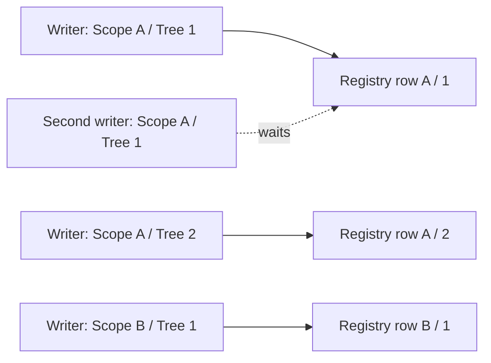

# Transactions and locking

Nested-set writes change row ranges. Every mutation therefore combines one
atomic database boundary with a lock on each complete tree identity it can
modify.

## Tree-local serialization

The complete identity is `TreeId` for an unscoped hierarchy and
`(Scope, TreeId)` for a scoped hierarchy. Each configured hierarchy owns a
typed registry table whose identity columns copy the node mapping's store type,
converter, facets, and collation.



Writers for one tree serialize. Writers for distinct trees do not share a
library-level global lock. SQLite still serializes writers according to its
database-level locking rules.

Distinct registry rows do not guarantee that every domain-table INSERT can
finish while another transaction remains open. On MariaDB, duplicate-key and
foreign-key checks can retain index-record locks even at `READ COMMITTED`;
reusing a recently deleted node key can therefore make otherwise independent
trees wait on the entity table's unique index until MVCC can purge the old
record. Treat that as database-level contention, keep caller transactions
short, and retry the complete operation from a new application transaction
after a lock timeout. See the
[MariaDB InnoDB lock modes](https://mariadb.com/docs/server/server-usage/storage-engines/innodb/innodb-lock-modes)
and [MariaDB InnoDB purge](https://mariadb.com/docs/server/server-usage/storage-engines/innodb/innodb-purge).

The registry also stores Revision and Lifecycle. A deleted or merged tree is
tombstoned, so its TreeId is not silently reused. Applications never create,
update, or delete registry rows directly.

`PurgeTreeIdAsync` is the sole supported registry-row removal path. It uses the
same transaction and exact-tree lock protocol, accepts only a tombstone, and
verifies that no hidden or visible nodes remain before deleting the row.

## Provider lock behavior

| Provider | Registry lock behavior |
| --- | --- |
| Doka MySQL/MariaDB | Locking read/update of the exact typed registry row inside the transaction |
| PostgreSQL | Row lock on the exact typed registry row |
| SQL Server | Update/exclusive row lock on the exact typed registry row |
| SQLite | Transactional write serialization with the same public tree-identity contract |

Cross-tree operations lock both registry rows. The library asks the database to
order the typed identities and acquires locks in that order. Database comparison
semantics therefore determine ordering; CLR hashes and string formatting do
not.

## Transaction ownership

When no transaction is active, a mutation starts, commits, and disposes its own
transaction. When the context already owns a compatible transaction, the
mutation creates a savepoint, rolls back to it after a definite failure, and
leaves final commit or rollback to the caller.

```csharp
await using var transaction =
    await context.Database.BeginTransactionAsync(cancellationToken);

await groups.MoveToAsync(groupId, destinationId, cancellationToken);
context.RoleAssignments.Add(new RoleAssignment(userId, groupId, roleId));
await context.SaveChangesAsync(cancellationToken);

await transaction.CommitAsync(cancellationToken);
```

The hierarchy and domain writes must use the same context, connection, and
transaction. An ambient `System.Transactions` transaction is rejected; use an
explicit EF Core transaction.

On SQL Server, disable Multiple Active Result Sets in the connection string
(`MultipleActiveResultSets=False`). EF Core does not create savepoints when
MARS is enabled, even if no second result set is active. NestedSet checks
`SupportsSavepoints` and rejects an incompatible caller transaction before
hierarchy writes. See EF Core's
[savepoint documentation](https://learn.microsoft.com/en-us/ef/core/saving/transactions#savepoints).

On SQL Server, a caller transaction must have `SET XACT_ABORT OFF`. The library
checks this before creating its savepoint and rejects `ON` with
`InvalidTransaction` before issuing any hierarchy write. With `ON`, a
caught duplicate-key error during tree reservation can make the entire
transaction uncommittable, so rolling back only to a savepoint is impossible.
The library does not change the caller's session setting. SQL Server uses `OFF`
by default for T-SQL statements; applications that enable `ON` must disable it
before calling a nested-set mutation in the same transaction. See Microsoft's
[TRY...CATCH](https://learn.microsoft.com/en-us/sql/t-sql/language-elements/try-catch-transact-sql)
and [SET XACT_ABORT](https://learn.microsoft.com/en-us/sql/t-sql/statements/set-xact-abort-transact-sql)
documentation.

## Retrying execution strategies

A retrying execution strategy must own the complete repeatable application
unit. Create a fresh context and transaction inside its delegate, include all
hierarchy and domain writes, and commit there:

```csharp
await using var strategyContext =
    await contextFactory.CreateDbContextAsync(cancellationToken);

var strategy = strategyContext.Database.CreateExecutionStrategy();

await strategy.ExecuteAsync(async token =>
{
    await using var context = await contextFactory.CreateDbContextAsync(token);
    await using var transaction =
        await context.Database.BeginTransactionAsync(token);
    var groups = context.NestedSet<UserGroup>().ForScope(tenantId);

    await groups.MoveToAsync(groupId, destinationId, token);
    context.RoleAssignments.Add(new RoleAssignment(userId, groupId, roleId));
    await context.SaveChangesAsync(token);
    await transaction.CommitAsync(token);
}, cancellationToken);
```

A configured retry strategy with a transaction created outside its active
delegate is rejected before hierarchy SQL. A library-owned transaction is also
rejected while retrying execution is active. These guards prevent an isolated
range update from being replayed without the application's complete unit or
idempotency decision.

This follows EF Core's documented transaction and connection-resiliency
contracts:

- [Transactions](https://learn.microsoft.com/en-us/ef/core/saving/transactions)
- [Connection resiliency](https://learn.microsoft.com/en-us/ef/core/miscellaneous/connection-resiliency)

## Savepoints and failure handling

A caller transaction keeps commit ownership. The library savepoint protects its
own mutation, including registry revision and lifecycle changes. Definite
failures roll back database work and restore structural CLR values that the
operation temporarily assigned.

Rollback and cleanup use `CancellationToken.None` after forward progress has
failed. Reusing an already canceled request token could abandon transaction
cleanup and leave context state unknown.

A connection failure during commit can be ambiguous: the server may have
committed even though the client did not receive acknowledgement. The library
does not automatically replay that outcome. Discard the context, open a new
one, reconcile by stable application identity and TreeId, validate the affected
trees, and only then decide whether a new command is required.

## Tracking and coordinated saves

Explicit set-based mutations reject tracked hierarchy rows in every affected
tree because their coordinates would become stale. Hierarchy rows from other
trees and unrelated domain entities may remain tracked when they have no
incompatible pending changes.

Tracked Parent or configured-order changes use `NestedSetDbContext` or
`SaveNestedSetChangesAsync`. The coordinator:

1. snapshots original structural state;
2. determines every affected tree;
3. acquires registry locks in stable order;
4. rechecks every changed node and Parent endpoint under those locks, rejecting
   a concurrent move into an unlocked tree before saving payload;
5. invokes the application's base EF save exactly once;
6. performs structural updates inside the same locks and rollback boundary;
7. refreshes tracked coordinates and store-generated concurrency values; and
8. accepts changes only after the complete boundary succeeds.

If a changed node or Parent endpoint moved to an unlocked tree between the
initial lookup and lock acquisition, the save throws
`DbUpdateConcurrencyException` before the payload write. Retry only the
complete application unit after reading its current tree identities again.

Without this wrapper, the options-registered save guard rejects structural and
order-property changes before SQL.

## Deadlocks and timeouts

Keep transactions short and use one application-wide order for domain locks and
hierarchy calls. Do not perform user interaction or remote I/O while holding a
tree lock. A deadlock victim, serialization failure, lock timeout, or SQLite
busy error fails the complete mutation and preserves the provider exception.

Investigate registry lock wait, transaction duration, cross-tree access order,
direct SQL writers, and physical query plans. Do not disable locking or split a
structural mutation into separately committed statements. See
[Deployment and recovery](runbooks/deployment-and-recovery.md).

## Direct writers

Any code that changes Scope, TreeId, Parent, Left, Right, Depth, Position, or a
configured order property can violate the contract. `ExecuteUpdate`,
`ExecuteDelete`, raw SQL, triggers, another ORM, and maintenance scripts must
not bypass the same tree locks and transaction boundary. For controlled repair,
stop writers or use the documented maintenance API and validate the exact tree
before returning it to service.
