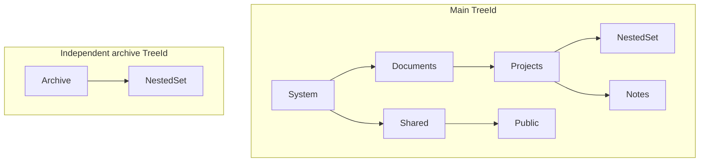

# FileSystem

A runnable folder hierarchy using the Doka MySQL/MariaDB provider. MariaDB
11.8 is the default route; MySQL and a persistent local SQLite file are
optional routes. This sample has no scope, tenant entity, or separate tree
entity. Each independent tree has its own stable `TreeId`.

Run commands from the repository root with the .NET 10 SDK. See the
[shared sample setup](../README.md) for database provisioning, endpoint
overrides, and database ownership.

## Start, inspect, and repeat

Start the local MariaDB service and provision the sample databases as described
in the [Docker guide](../../docker/README.md), then run:

```sh
docker compose -f docker/compose.yml --profile mariadb up -d --build --wait --wait-timeout 180
docker compose -f docker/compose.yml exec -T mariadb bash -s < docker/provision-samples.sh
dotnet run --project samples/FileSystem --configuration Release
```

Fresh Docker volumes run provisioning automatically. The explicit provisioning
command also supplies the databases and grants on an existing volume.

All seven independent scenarios run in the documented order. Each creates its
own small forest through public NestedSet operations and uses a fresh context.
They do not require earlier scenarios to have run.

To focus on one operation:

```sh
dotnet run --project samples/FileSystem --configuration Release -- --scenario rename
```

Results remain in `nestedset_sample_filesystem` after success or failure so you
can inspect them in Rider. A repeated execution is rejected until you explicitly
request a reset:

```sh
dotnet run --project samples/FileSystem --configuration Release -- --inspect --details
dotnet run --project samples/FileSystem --configuration Release -- --reset --scenario rename
```

`--reset` recreates only this sample's owned database. It does not reset the KPI
or user-group databases. `--inspect` does not apply migrations, seed data, or
perform hierarchy writes, and cannot be combined with `--reset` or `--scenario`.

For a route that needs no server:

```sh
dotnet run --project samples/FileSystem --configuration Release -- --provider sqlite
dotnet run --project samples/FileSystem --configuration Release -- --provider sqlite --inspect --details
dotnet run --project samples/FileSystem --configuration Release -- --provider sqlite --reset --scenario queries
```

The default SQLite file is
`artifacts/samples/nestedset_sample_filesystem.sqlite`. It persists between
invocations; its inspection connection opens the existing file read-only.

Use `--provider mysql` for MySQL, `--details` for structural columns, and
`--help` for the complete command contract. Ctrl+C cancels awaited operations;
the application exits with code 130. Unexpected failures exit with code 1.

## Application model and registration

[Folder](Model/Folder.cs) implements the optional `INestedSetNode<int, Guid>`
contract. The application owns `Name` and `Category`; NestedSet maintains
`TreeId`, `ParentId`, `Left`, `Right`, `Depth`, and `Position`.

[FileSystemContext](FileSystemContext.cs) exposes the ordinary
`DbSet<Folder> Folders`. It applies a separate
[FolderConfiguration](Model/FolderConfiguration.cs):

```csharp
builder.HasNestedSet(node => node
    .HasParent(folder => folder.ParentId)
    .OrderBy(folder => folder.Name)
    .ThenBy(folder => folder.Category));
```

The interface supplies the other structural selectors. Omitting `HasScope`
means callers also omit `ForScope`:

```csharp
var folders = context.NestedSet<Folder>();
```

Sibling ordering is strict and uses database comparison semantics. NestedSet
adds the node key as the final deterministic tie-breaker. The full tree remains
in hierarchy preorder; do not append a global `OrderBy(Name)` to its query.

The shared endpoint setup registers the default Doka route as:

```csharp
options
    .UseMySql(connectionString, MySqlServerVersion.MariaDb(new Version(11, 8, 0)))
    .UseNestedSets();
```

The optional `NestedSetDbContext` base coordinates tracked sort-field edits
during `SaveChangesAsync`. Projects with an existing base context or save
override can compose that integration instead; see the
[UserGroups sample](../UserGroups/README.md). Hierarchy insertion remains an
explicit `InsertRootAsync`, `InsertChildAsync`, or bulk operation.

## Independent scenarios

| Command value | What to read | Observable result |
| --- | --- | --- |
| `queries` | [QueryScenario](Scenarios/QueryScenario.cs) | The complete tree, a subtree, children, parent, and nearest matching ancestor are selected directly from an ID. The archive's matching folder stays excluded. |
| `rename` | [RenameScenario](Scenarios/RenameScenario.cs) | An ordinary tracked edit changes Shared to Assets. `SaveChangesAsync` moves Assets and its child before Documents. |
| `move` | [MoveScenario](Scenarios/MoveScenario.cs) | Projects moves under Shared, then into Archive, then becomes a separate tree with a root at depth zero. |
| `delete` | [DeleteScenario](Scenarios/DeleteScenario.cs) | Deleting Projects promotes its children. Deleting Documents as a subtree removes its descendants. Deleting Archive removes only that independent tree. |
| `bulk` | [BulkScenario](Scenarios/BulkScenario.cs) | An atomic forest import assigns generated keys and parent links, followed by another subtree import under Projects. |
| `maintenance` | [MaintenanceScenario](Scenarios/MaintenanceScenario.cs) | Quick/full validation and a read-only rebuild plan inspect a healthy tree. Rebuild preserves its canonical structure. |
| `rejected` | [RejectedOperationScenario](Scenarios/RejectedOperationScenario.cs) | Cycles, explicit placement under strict ordering, and single-node root deletion produce expected error codes; stored data stays unchanged. |

Most scenarios initialize this deliberately small forest. Tree identities
differ for every selectable scenario, so `all` has no hidden ordering dependency.



Both trees number their bounds independently. `TreeId` separates them even
when bounds, names, and depths overlap.

The rename scenario displays this change:

```text
Before rename
System
  Documents
    Projects
      NestedSet
      Notes
  Shared
    Public

After renaming Shared to Assets
System
  Assets
    Public
  Documents
    Projects
      NestedSet
      Notes

Assets is now position 0; Public moved together with its parent.
```

## Query from a node ID

No separate load of the anchor is required:

```csharp
var matches = await context
    .NestedSet<Folder>()
    .TreeContaining(folderId)
    .Where(folder => folder.Name == "NestedSet")
    .ToListAsync(cancellationToken);

var nearestSystemAncestor = await context
    .NestedSet<Folder>()
    .AncestorsOf(folderId)
    .Where(folder => folder.Category == "System")
    .OrderByDescending(folder => folder.Depth)
    .FirstOrDefaultAsync(cancellationToken);
```

The first query stays inside the anchor's tree. The second returns the nearest
strict ancestor matching the application predicate, or null if none matches.
QueryScenario's NestedSet folder returns Projects.

## Schema and maintenance

The checked-in [Doka migrations](Migrations/MySql) and
[SQLite migrations](Migrations/Sqlite) initialize the same model through
provider-specific context types. Factories construct options without database
I/O. The launcher applies migrations before a fresh run; it never combines
`EnsureCreated` with the migration history.

The model derives indexes for the actual configuration, including:

- `(TreeId, Left)` and `(TreeId, Right)` for structural ranges;
- `(TreeId, ParentId, Position)` for ordered siblings;
- `(TreeId, ParentId, Name, Category, Id)` for configured sibling ordering.

The self-referencing foreign key uses `Restrict` because node deletion promotes
children before physically deleting their old parent. Registry rows and
tombstones are part of the normal migration model. SafeMigrations is optional,
not required to run these scenarios.

Maintenance intentionally does not corrupt the database to demonstrate repair.
`PlanRebuildAsync` is read-only and reports whether stored parent links and
positions support a rebuild. Rebuild reconstructs derived coordinates from
valid adjacency; it cannot invent a missing parent or resolve an ambiguous
cycle.

## Boundaries

These folders illustrate hierarchy storage, not an operating-system filesystem:
there is no disk access, path normalization, authorization policy, symlink
handling, or filename uniqueness policy. Names and categories use simple
sample data; configured ordering follows the selected database collation.

Tree output materializes only these small demonstration trees. Production
applications should project the data they need and use bounded result sets or
streaming when appropriate. A context is one unit of work and every operation
is awaited before the next one; the sample does not share a context across
concurrent tasks.
