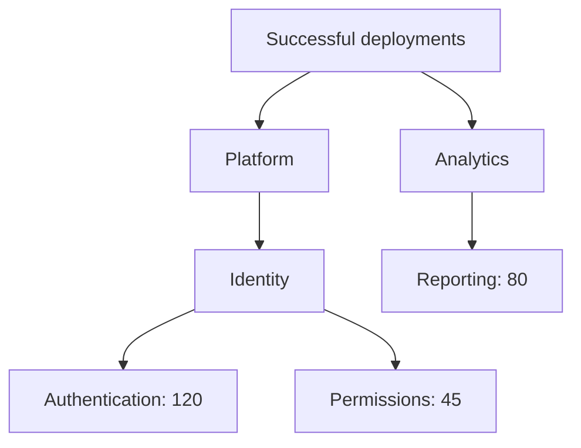

# KPI sample

This console application adapts an existing metric model to NestedSet without an
entity interface or base class. It demonstrates database-side aggregation, manual
sibling ordering and ordinary EF payload updates. Its results remain available
for inspection in Rider.

The example counts **successful deployments for one reporting period**. Only
service leaves carry measurements. The rule for aggregating this particular unit
belongs to the application; NestedSet supplies the hierarchy query. Percentages,
averages and measurements with different units would need different domain rules.

## Run from the repository root

Start the existing developer MariaDB service, then run the default Doka route:

```sh
docker compose -f docker/compose.yml --profile mariadb up --build --wait --wait-timeout 180
docker compose -f docker/compose.yml exec -T mariadb bash -s < docker/provision-samples.sh
dotnet run --project samples/Kpis -- --scenario aggregate
```

The default is the Doka provider with **MariaDB 11.8**. The developer Docker setup
provides the dedicated `nestedset_sample_kpis` database and its local application
credentials. See [Docker setup](../../docker/README.md) for image preparation and
service configuration.

To use the optional SQLite route, no container is required:

```sh
dotnet run --project samples/Kpis -- --provider sqlite --scenario aggregate
```

SQLite keeps the database at `artifacts/samples/nestedset_sample_kpis.sqlite` when
started from the repository root. `NESTEDSET_SAMPLE_SQLITE_DIRECTORY` changes its
directory while retaining the fixed sample filename.

MySQL uses the same Doka migration set:

```sh
docker compose -f docker/compose.yml --profile mysql up --build --wait --wait-timeout 180
docker compose -f docker/compose.yml exec -T mysql bash -s < docker/provision-samples.sh
dotnet run --project samples/Kpis -- --provider mysql --scenario aggregate
```

`NESTEDSET_SAMPLE_CONNECTION_STRING` can select another MySQL/MariaDB endpoint.
Omit `Database`, or set it to exactly `nestedset_sample_kpis`. A different database
name is rejected before any database access, including a requested reset. The
sample does not print connection strings or passwords.

## Repeat and inspect

The first run applies the checked-in EF migrations and inserts the example data
through the public NestedSet APIs. It does not use `EnsureCreated` and does not
require SafeMigrations.

```sh
# Inspect retained results without migrations, seeding or writes.
dotnet run --project samples/Kpis -- --inspect --details

# Start all four independent scenarios from a fresh sample database.
dotnet run --project samples/Kpis -- --reset

# Repeat just one scenario from its defined starting state.
dotnet run --project samples/Kpis -- --reset --scenario order

# Print usage without accessing a database.
dotnet run --project samples/Kpis -- --help
```

Add `--provider sqlite` or `--provider mysql` to each command when using that
route. A normal start rejects an already initialized database instead of appending
duplicates or silently skipping steps. `--reset` deletes and recreates only this
sample's owned database, including results of its other scenarios. Inspection
cannot be combined with reset or scenario execution. Ctrl+C requests cooperative
cancellation; canceled or failed runs retain their committed state for inspection.

| Scenario | Operation | Checked result |
| --- | --- | --- |
| `aggregate` | Compose a scoped descendant query with a SQL leaf sum. | Platform totals 165; the reporting tree totals 245. |
| `order` | Explicitly place Analytics before Platform. | Child positions become 0 and 1; the total remains 245. |
| `update` | Update a tracked service through the ordinary `DbSet` and `SaveChangesAsync`. | Authentication becomes 150; Platform totals 195 and the tree totals 275. |
| `rejected` | Attempt to move Platform beneath its own Authentication descendant. | `CycleDetected` is reported; every structural property remains unchanged. |

`all` is the default. Each scenario has its own deterministic trees and a fresh
context, so it can also run independently. `--details` adds identity, depth,
position and bounds to the readable tree output. Exit code 0 means the documented
results passed; 1 reports an invalid command or failure; 130 reports cancellation.

## Reporting model



```text
Successful deployments [aggregate]
  Platform
    Identity
      Authentication = 120
      Permissions = 45
  Analytics
    Reporting = 80

Platform: 165; complete reporting tree: 245.
Excluded: another tree in this project (444) and another project using the same TreeId (999).
```

All three trees belong to the same entity table. `ProjectId` selects the application
partition; `TreeId` selects an independent tree inside that partition. The other
project deliberately uses the primary tree's `TreeId` to demonstrate that a
scoped tree is identified by **both values**. The separate reporting period in the
main project has a different `TreeId`. Neither can contribute to the reporting
root's descendant aggregate.

`ProjectId` is an ordinary application-owned key. There is no additional Project
entity, and neither NestedSet nor this configuration requires one. Applications
that do not need partitions can omit `HasScope` and `ForScope`; the
[FileSystem sample](../FileSystem/README.md) demonstrates that route.

## Entity and EF configuration

[Kpi](Domain/Kpi.cs) uses existing structural names: `NodeId`, `Start`, `End`,
`Level`, `SiblingPosition` and `ParentMetricId`. Its structural setters are private;
hierarchy changes use the explicit facade. `Title` and `SuccessfulDeployments`
remain ordinary tracked payload properties.

[KpiConfiguration](Configuration/KpiConfiguration.cs) is an ordinary
`IEntityTypeConfiguration<Kpi>`:

```csharp
builder.HasNestedSet(node => node
    .HasNodeKey(metric => metric.NodeId)
    .HasBounds(metric => metric.Start, metric => metric.End)
    .HasDepth(metric => metric.Level)
    .HasPosition(metric => metric.SiblingPosition)
    .HasTreeId(metric => metric.TreeId)
    .HasScope(metric => metric.ProjectId)
    .HasParent(metric => metric.ParentMetricId));
```

There is no configured `OrderBy`: siblings retain explicitly chosen positions.
The composite parent relationship includes `ProjectId`, so an ordinary foreign
key cannot link metrics across projects. The NestedSet configuration contributes
its structural indexes and tree registry to the regular EF model and migrations.

[KpiContext](Data/KpiContext.cs) exposes a normal `DbSet<Kpi>` and uses the optional
`NestedSetDbContext` convenience base. Database options register the extension
once through `UseNestedSets()` alongside Doka's `UseMySql`. The
[UserGroups sample](../UserGroups/README.md) shows composition with an existing
`DbContext` and SaveChanges override instead of inheriting this convenience base.

## Read and update

The [aggregate helper](Scenarios/KpiScenarioSupport.cs) resolves the anchor and
tree in the query; it does not load the node or all measurements first:

```csharp
var metrics = context.NestedSet<Kpi>().ForScope(projectId);

var platformCount = await metrics
    .DescendantsOf(platformId)
    .Where(metric => metric.End == metric.Start + 1)
    .SumAsync(metric => metric.SuccessfulDeployments ?? 0, cancellationToken);
```

The application counts leaves only, treating a missing measurement as zero. All
leaf measurements in this example use the same unit and period. The aggregate is
computed by the database; tree materialization is used only for the deliberately
small before/after console display.

Explicit ordering is a separate operation:

```csharp
await metrics.MoveBeforeAsync(analyticsId, platformId, cancellationToken);
```

An ordinary payload update uses the existing set and save path:

```csharp
var metric = await context.Kpis
    .SingleAsync(node => node.NodeId == authenticationId, cancellationToken);

metric.SuccessfulDeployments = 150;
await context.SaveChangesAsync(cancellationToken);
```

The [update scenario](Scenarios/UpdateScenario.cs) also renames the service and
checks that its manually chosen parent and sibling position remain unchanged.
The [rejection scenario](Scenarios/RejectedScenario.cs) handles only the expected
`CycleDetected` code and compares the complete tree structure before and after.
Every scenario fully validates its primary tree and both isolation examples.

## Source map and migrations

| File | Responsibility |
| --- | --- |
| [Program](Program.cs) | Command selection, context ownership and exit codes. |
| [Kpi](Domain/Kpi.cs) | Existing-like domain model and measurement semantics. |
| [KpiConfiguration](Configuration/KpiConfiguration.cs) | Explicit mapping, parent integrity and manual order. |
| [KpiContext](Data/KpiContext.cs) | Normal EF set and optional managed-save integration. |
| [KpiDataset](Scenarios/KpiDataset.cs) | Small, fixed data inserted through public hierarchy operations. |
| [Aggregate](Scenarios/AggregateScenario.cs) | SQL aggregation and separate scope/tree isolation. |
| [Order](Scenarios/OrderScenario.cs) | Explicit sibling placement and preserved aggregate. |
| [Update](Scenarios/UpdateScenario.cs) | Ordinary payload update and recomputed aggregate. |
| [Rejected](Scenarios/RejectedScenario.cs) | Expected cycle error and preserved structure. |

The Doka migration set belongs to `KpiContext`; the optional SQLite set belongs
to `KpiSqliteContext`. Their design-time factories construct provider options
without opening connections or changing schema. The SQLite-specific context
exists only to separate provider migrations; the entity and configuration are
shared. See [migration guidance](../../docs/migrations.md) for application schema
changes and optional SafeMigrations integration.
