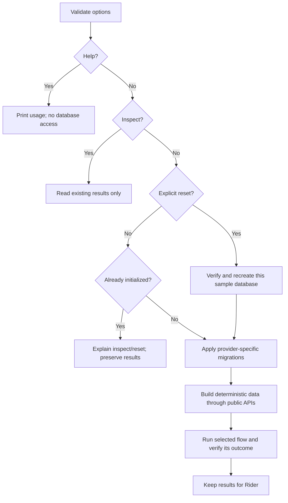

# Runnable samples

These three independent .NET 10 console applications show complete domain flows
through the public NestedSet API. Each owns its normal DbSets, entities,
`IEntityTypeConfiguration<T>` mappings, context and migrations. Doka with
MariaDB 11.8 is the default; MySQL 8.4 and persistent SQLite files are optional.
All projects appear directly under `samples` in Rider.

| Project | Start here to learn | Scope |
| --- | --- | --- |
| [FileSystem](FileSystem/README.md) | Independent trees, alphabetical siblings, queries, moves, delete semantics, bulk and maintenance | Omitted entirely |
| [Kpis](Kpis/README.md) | Adapt an existing model, aggregate leaf measurements in SQL, use manual sibling order | ProjectId |
| [UserGroups](UserGroups/README.md) | Tenant isolation, inherited privileges from multiple user groups, supervisor lines with shadow coordinates, and atomic transactions | TenantId |

FileSystem and Kpis use the optional `NestedSetDbContext` convenience base.
UserGroups keeps an ordinary `DbContext` and integrates NestedSet into its
existing asynchronous save customization. All expose normal DbSets and use
`context.NestedSet<TEntity>()`; no additional hierarchy property is required.

## Start Doka with MariaDB

Run all commands from the repository root. Docker creates only the selected
developer service, using the existing [shared image pins](../docker/database-images.Dockerfile).

```sh
docker compose -f docker/compose.yml --profile mariadb up --build --wait --wait-timeout 180
docker compose -f docker/compose.yml exec -T mariadb bash -s < docker/provision-samples.sh
dotnet run --project samples/FileSystem -c Release -- --scenario queries
dotnet run --project samples/FileSystem -c Release -- --inspect --details
```

The provisioning command is idempotent. New volumes run it automatically;
explicit execution also supports an already initialized volume. It creates
missing databases and grants without removing existing rows. For MySQL, select
the `mysql` profile/service and pass `--provider mysql` to the sample.

The normal local application account is used by the samples, not root.
Provisioning runs inside the configured developer service using its existing
administrative credentials. The connection defaults match [Docker setup](../docker/README.md).

## Select a flow

```sh
dotnet run --project samples/FileSystem -c Release -- --help
dotnet run --project samples/Kpis -c Release -- --scenario aggregate
dotnet run --project samples/UserGroups -c Release -- --scenario inheritance
dotnet run --project samples/UserGroups -c Release -- --scenario supervisors
```

Without `--scenario`, a project executes all its flows in the documented order.
Each flow starts with its own deterministic dataset and a fresh context, so it
does not depend on the result of another flow. Ctrl+C cancels awaited database
work and exits with code 130. A failed expectation or invalid invocation exits
with a nonzero code and a specific message.

| Option | Meaning |
| --- | --- |
| `--provider mariadb\|mysql\|sqlite` | Select the route; default is mariadb |
| `--scenario NAME\|all` | Select an independent flow; default is all |
| `--inspect` | Read stored results without migrations, seeding or updates |
| `--reset` | Recreate only this project's fixed sample database before running |
| `--details` | Include node/tree identities, bounds, depth and position |
| `--help` | Show options without resolving or accessing the database |

Inspection cannot be combined with a scenario selection or reset. Duplicate
options, unknown names and missing values are rejected before database access.

## Retain, inspect and repeat

Each project has a fixed database:

| Project | Server database | SQLite filename |
| --- | --- | --- |
| FileSystem | nestedset_sample_filesystem | nestedset_sample_filesystem.sqlite |
| Kpis | nestedset_sample_kpis | nestedset_sample_kpis.sqlite |
| UserGroups | nestedset_sample_usergroups | nestedset_sample_usergroups.sqlite |

Results remain stored after successful runs and unexpected failures. Add these
databases to Rider using the connections in the Docker guide. Stopping the
developer services preserves their named volumes.

A previously initialized sample refuses a normal rerun, including a run whose
scenario removed every node: the tree registry can still contain retired
identities. Inspect the result or explicitly reset that sample:

```sh
dotnet run --project samples/FileSystem -c Release -- --inspect
dotnet run --project samples/FileSystem -c Release -- --scenario rename --reset
```

Reset neither targets the general developer database `nestedset` nor the other
two sample databases. Configuration and the actual EF connection are checked
before deletion. A server connection override may omit `Database` or name the
exact database for this project; a different name is rejected.



## Optional SQLite route

SQLite needs no server and uses the same public hierarchy operations:

```sh
dotnet run --project samples/FileSystem -c Release -- --provider sqlite --scenario queries
dotnet run --project samples/FileSystem -c Release -- --provider sqlite --inspect --details
```

When started from the repository root, files live under `artifacts/samples/`.
`NESTEDSET_SAMPLE_SQLITE_DIRECTORY` can select another directory, but each
sample still owns its fixed filename. Inspection opens SQLite in read-only mode
and rejects missing files rather than creating an empty database.

## Endpoint configuration

`NESTEDSET_SAMPLE_CONNECTION_STRING` overrides the server endpoint and credentials.
For example, omit `Database` when using the same endpoint for all three projects.
Select the engine explicitly with `--provider`; the matching Doka server version
is configured without a design-time connection. Endpoint descriptions do not
print credentials. See Docker's separate `NESTEDSET_DEV_*` overrides if changing
its port or initial account configuration.

No sample executes `docker compose down --volumes`. That command deletes all
databases in the developer volume and is a separate explicit developer action.

## Mapping and migration source

Each project keeps its own entities, EF configuration, context and scenarios;
`Scenarios/` contains the actual domain operations. `Program.cs` only handles
selection, context lifetime and output. Shared sources provide small common
command, endpoint, database and console helpers, linked as in the Doka examples.
They do not implement a scenario framework or hide hierarchy calls.

Each project includes separate `Migrations/MySql/` and `Migrations/Sqlite/`
chains and construct-only design-time factories. Its migrations include
the structural columns, self-FK, derived indexes and tree registry. UserGroups
has one initial migration per provider that includes both its group and supervisor hierarchies and user-group memberships.
The selected local sample applies its migration before populating a fresh database;
schema and scenario data are separate steps.

The Doka models and migrations explicitly use `utf8mb4_bin`, matching
provisioning and preserving the same comparison rules after `--reset`. SQLite
uses its native binary text comparison. These rules keep the sample's ASCII
names and permission codes predictable; an application's language-specific
alphabetical ordering requires its own database/column collation policy.

Do not mix `EnsureCreated` into these migration chains.

The two concrete context types share their domain configuration. This follows
EF's [multiple-provider migrations](https://learn.microsoft.com/en-us/ef/core/managing-schemas/migrations/providers)
guidance without adding a separate migrations project per provider. Review the
generated SQL with the appropriate context, for example:

```sh
dotnet ef migrations script --project samples/FileSystem --context FileSystemContext
dotnet ef migrations script --project samples/FileSystem --context FileSystemSqliteContext
```

Hierarchy rows are inserted through public single-node or bulk operations.
The library derives their coordinates; the samples do not hard-code bounds in
`HasData`. SafeMigrations is optional and is not needed to start any sample.

## Sources and further reading

- [.NET sample guidance](https://github.com/dotnet/samples) favors executable,
  explained console projects where a UI is unnecessary.
- [EF create/drop guidance](https://learn.microsoft.com/en-us/ef/core/managing-schemas/ensure-created)
  separates transient schema creation from migration-managed databases.
- [EF design-time factories](https://learn.microsoft.com/en-us/ef/core/cli/dbcontext-creation)
  explain construction for migration tooling.
- [EF collations](https://learn.microsoft.com/en-us/ef/core/miscellaneous/collations-and-case-sensitivity)
  explain the database comparison policy and its effect on ordering and indexes.
- [Transactions and locking](../docs/transactions-and-locking.md) defines the
  hierarchy transaction contract.
- [Operations](../docs/operations.md) documents query, mutation and maintenance
  semantics beyond the demonstrations.
