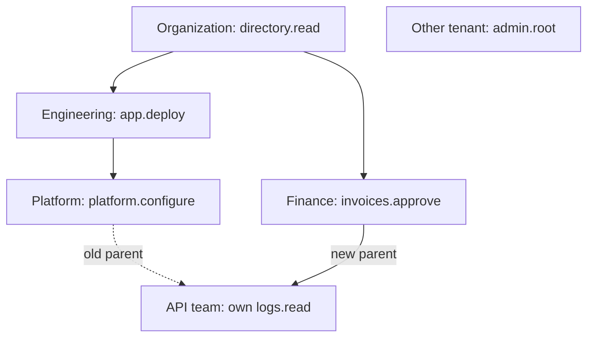
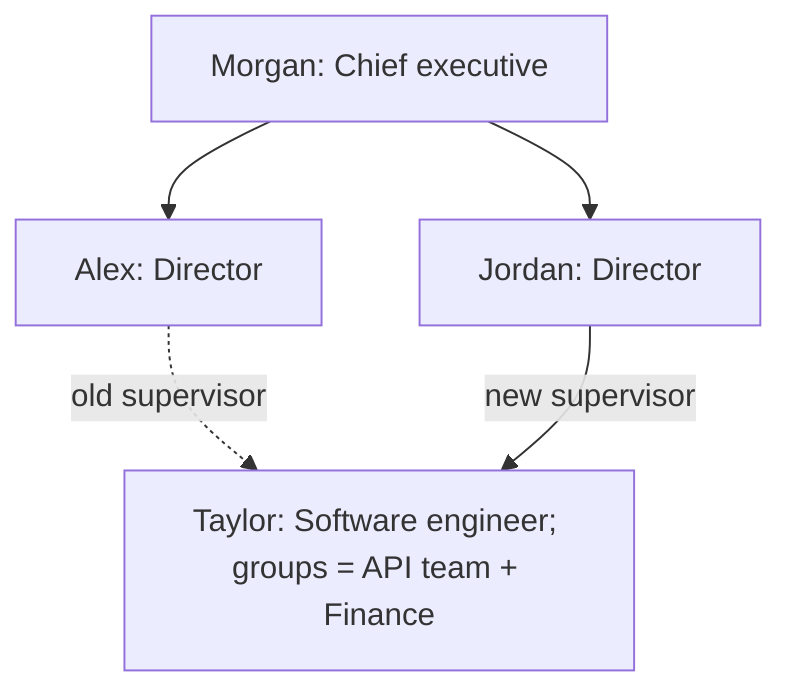
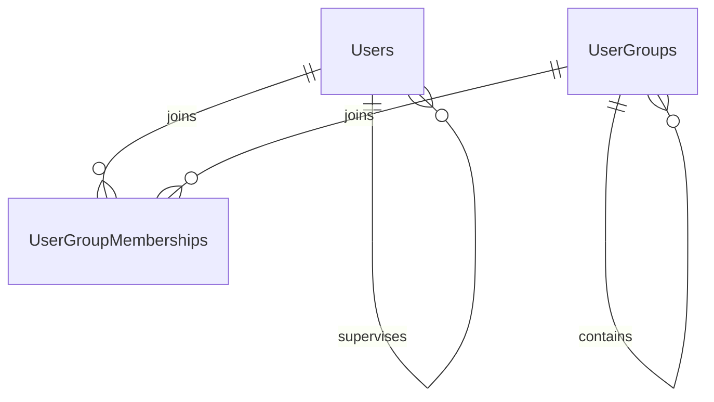
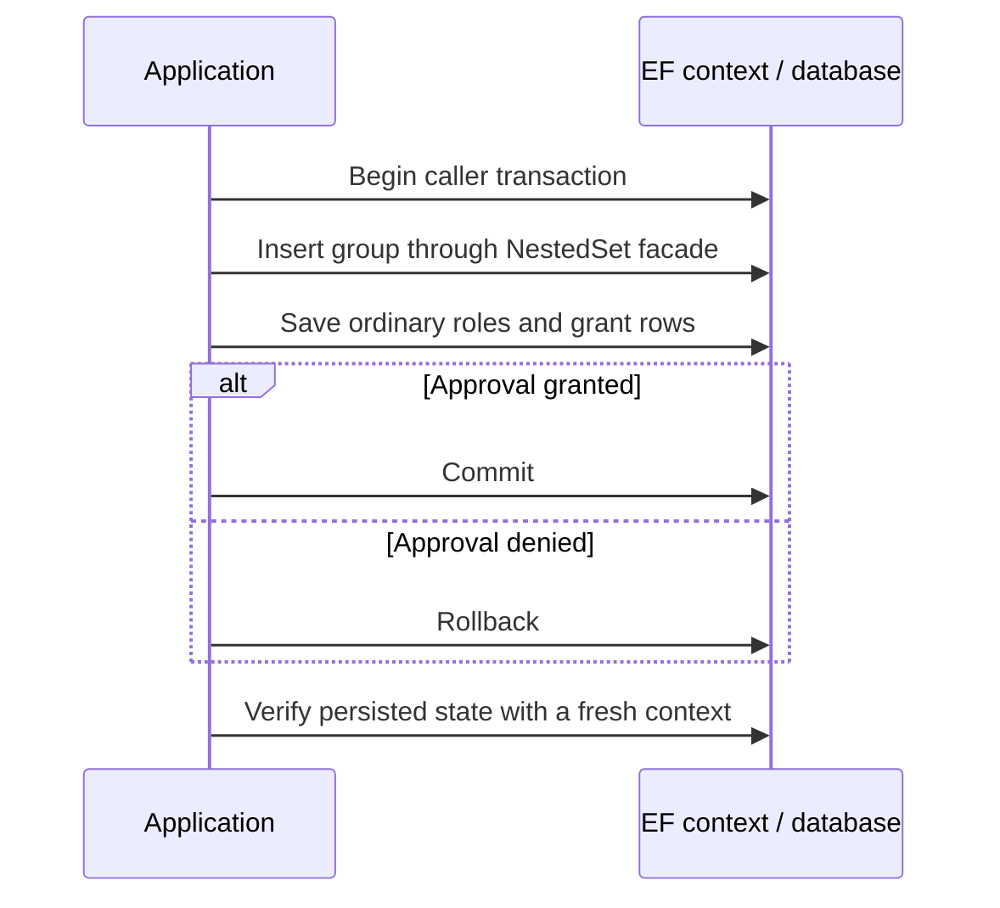

# User groups, users, roles and inherited privileges

This standalone console sample demonstrates two tenant-scoped hierarchies: groups with application-defined inherited
privileges, and users arranged by supervisor. A user can have zero or several groups in the same tenant; moving a user
beneath a different supervisor does not change those memberships or their grants. The sample uses the Doka provider
with MariaDB 11.8 by default; MySQL 8.4 and persistent SQLite are optional routes.

Here `User` represents a tenant-owned employee, not a global sign-in identity. Its visible `TenantId` names that ownership
and participates in the supervisor and membership foreign keys. If one sign-in identity can join several tenants,
model that identity separately from its tenant memberships and employee hierarchy nodes. EF Core documents the
[tenant discriminator column](https://learn.microsoft.com/en-us/ef/core/miscellaneous/multitenancy), while Microsoft's
[identity guidance](https://learn.microsoft.com/en-us/azure/architecture/guide/multitenant/approaches/identity#user-and-tenant-conflation)
explains why a user identity and a tenant must not be conflated.

The sample's application rule is explicit: a group receives the union of privileges from its own roles and its ancestors'
roles. Moving a group changes the inherited grants while keeping its direct assignments. This rule is implemented in
[PrivilegeQueries.cs](Queries/PrivilegeQueries.cs), not by NestedSet itself. A user's effective privileges are the
distinct union of grants inherited through every directly assigned group. There are no deny or override rules.

The multi-table queries in [PrivilegeQueries.cs](Queries/PrivilegeQueries.cs),
[GroupOutput.cs](Output/GroupOutput.cs), and [SupervisorOutput.cs](Output/SupervisorOutput.cs) use LINQ method syntax.
Equivalent query-syntax forms remain commented beside them for comparison; both forms retain the same tenant keys,
filters, projections, and ordering.

## Run from the repository root

Start the optional developer database once:

```sh
docker compose -f docker/compose.yml --profile mariadb up --build --wait --wait-timeout 180
docker compose -f docker/compose.yml exec -T mariadb bash -s < docker/provision-samples.sh
dotnet run --project samples/UserGroups/UserGroups.csproj -c Release
```

The first invocation applies the checked-in migration chain and runs all five scenarios. Results remain in
`nestedset_sample_usergroups`, including after the process exits. Open that database in Rider using the connection
settings in the [Docker guide](../../docker/README.md). Each scenario owns a separate tenant key and tree so its expected
result does not depend on another scenario running first.

```sh
dotnet run --project samples/UserGroups/UserGroups.csproj -c Release -- --inspect
dotnet run --project samples/UserGroups/UserGroups.csproj -c Release -- --inspect --details
dotnet run --project samples/UserGroups/UserGroups.csproj -c Release -- --reset --scenario inheritance
dotnet run --project samples/UserGroups/UserGroups.csproj -c Release -- --provider mysql --scenario commit
dotnet run --project samples/UserGroups/UserGroups.csproj -c Release -- --provider sqlite --scenario rollback
dotnet run --project samples/UserGroups/UserGroups.csproj -c Release -- --provider sqlite --scenario supervisors
dotnet run --project samples/UserGroups/UserGroups.csproj -c Release -- --help
```

Inspection performs only reads. The normal start rejects a prior initialized database, including a partial failed run,
and explains how to inspect or reset it. `--reset` deletes and recreates **only** this sample's fixed database before
running the selected scenario. A connection-string override naming another database is rejected before reset. No
automatic cleanup occurs after success or failure.

Inspection refuses an older schema instead of applying migrations as a side effect. The unpublished intermediate
migrations were replaced by one initial migration per provider. A local database created from an intermediate migration
does not have a supported in-place upgrade path in this sample; keep its data separately or use `--reset` only when
intentionally discarding that sample database.

The default SQLite file is `artifacts/samples/nestedset_sample_usergroups.sqlite`, relative to the working directory.
`NESTEDSET_SAMPLE_SQLITE_DIRECTORY` changes its parent directory. Use `NESTEDSET_SAMPLE_CONNECTION_STRING` for a server
endpoint override, omitting `Database` or setting it to `nestedset_sample_usergroups`. See the [sample catalog](../README.md)
for the shared provider and database setup. Ctrl+C propagates cancellation through database calls; success returns exit
code 0, errors return 1, and cancellation returns 130.

## Select a readable workflow

| Scenario | Visible application operation | Verified result |
| --- | --- | --- |
| `inheritance` | Move the API team from Platform to Finance; save a tracked payload rename. | Own `logs.read` remains, ancestor grants change, another tenant's `admin.root` is excluded, and the existing timestamp customization runs. |
| `commit` | Create an organization and team, then assign a role and privilege inside one caller transaction. | The hierarchy and every ordinary grant row are visible from a fresh context after commit. |
| `rollback` | Add provisional access under Finance, save the role data, then deny approval. | Rollback preserves every original parent and coordinate; no provisional group, role, permission, assignment or grant remains. |
| `rejected` | Attempt to move Engineering below its descendant API team. | `CycleDetected` is handled explicitly and the complete persisted structure remains unchanged. |
| `supervisors` | Give Taylor two groups and Morgan none, build a separate supervisor tree, filter ancestors by a business `Position`, then move Taylor beneath another director. | The reporting line and hidden bounds change; Taylor keeps both `logs.read` and `invoices.read` while Morgan has no group-derived grants. |

Every scenario finishes with full validation of its tree. Normal output shows small indented trees and specific results;
`--details` adds tenant/tree identities, node keys, parents, depth, position, and boundaries. Generated group/role keys and
UTC timestamps can differ between runs; the selected names, relationships, expected permission codes, and tree identities
are fixed by the scenario.

The inheritance workflow starts with:

```text
Organization              Member -> directory.read
  Engineering             Engineer -> app.deploy
    Platform              Platform maintainer -> platform.configure
      API team            Auditor -> logs.read
  Finance                 Billing approver -> invoices.approve
```

Before the move, the API team receives:

```text
app.deploy, directory.read, logs.read, platform.configure
```

After moving it below Finance:

```text
Organization
  Engineering
    Platform
  Finance
    API team

directory.read, invoices.approve, logs.read
```



The unrelated tenant deliberately uses the same `TreeId`. The `TenantId` scope keeps the trees isolated. The privilege
query also applies the tenant key to the ordinary role and grant tables, and their composite foreign keys prevent
persisting a relationship between endpoints from different tenants. Tenant selection is an application responsibility;
a hierarchy scope itself is not an authorization check.

The `supervisors` workflow adds a second NestedSet mapping in the same context:

```text
Morgan - Chief executive (groups: none)
  Alex - Director (groups: Engineering)
    Taylor - Software engineer (groups: API team, Finance)
  Jordan - Director (groups: Finance)
```

After moving Taylor beneath Jordan, `AncestorsOf(taylorId).Where(user => user.Position == "Director")` finds Jordan
without loading Taylor first. Taylor remains in both API team and Finance and retains their distinct `logs.read` and
`invoices.read` grants. Morgan has no groups and therefore no group-derived grants. Supervisor ancestry is not treated
as a privilege source.





## Configuration remains ordinary EF code

[UserGroup](Entities/UserGroup.cs) is a plain entity with no required NestedSet interface or base type. `TenantId` is a
simple scope value; no additional tenant or tree entity is required. [UserGroupConfiguration](Data/Configurations/UserGroupConfiguration.cs)
implements `IEntityTypeConfiguration<UserGroup>` and explicitly selects `Id`, `TenantId`, `TreeId`, `ParentId`,
`Left`, `Right`, `Depth`, and `Position`. This sample uses manually maintained sibling order; the FileSystem sample
demonstrates configured alphabetical ordering.

[User](Entities/User.cs) is also a plain entity. Its public `Position` is a job title such as `Director`. The technical
`TreeId`, `Left`, `Right`, and `NestedSetPosition` values are **shadow properties**: they exist in the EF model and
database, not as CLR members of `User`. [UserConfiguration](Data/Configurations/UserConfiguration.cs) declares the tree
identity as `Guid` and the three coordinates as `long` before selecting them by name:

```csharp
builder.Property<Guid>(UserHierarchyProperties.TreeId);
builder.Property<long>(UserHierarchyProperties.Left);
builder.Property<long>(UserHierarchyProperties.Right);
builder.Property<long>(UserHierarchyProperties.NestedSetPosition);

builder.HasNestedSet(node => node
    .HasNodeKey(user => user.Id)
    .HasScope(user => user.TenantId)
    .HasTreeId(UserHierarchyProperties.TreeId)
    .HasParent(user => user.SupervisorId)
    .HasBounds(UserHierarchyProperties.Left, UserHierarchyProperties.Right)
    .HasDepth(user => user.Depth)
    .HasPosition(UserHierarchyProperties.NestedSetPosition));
```

The same-tenant supervisor foreign key and the two [membership](Entities/UserGroupMembership.cs) foreign keys are
configured separately. The membership key `(TenantId, UserId, UserGroupId)` prevents duplicates; composite foreign keys
ensure both endpoints belong to the same tenant. User deletion cascades to memberships, while group deletion with
memberships requires an explicit application decision. This uses EF Core's
[direct join-entity pattern](https://learn.microsoft.com/en-us/ef/core/modeling/relationships/many-to-many#direct-use-of-join-table)
without collection navigations on every user or group. Queries can refer to a shadow coordinate with
`EF.Property<long>(user, UserHierarchyProperties.Left)` while EF translates the query. Inspection projects
`EF.Property<Guid>(user, UserHierarchyProperties.TreeId)` to select each stored tree without tracking users. A detached
user instance has no CLR tree identity or coordinates to read. Inserting a root still requires an explicit tree ID, and
`InTree(treeId)` still distinguishes trees. This follows
[EF Core's shadow-property contract](https://learn.microsoft.com/en-us/ef/core/modeling/shadow-properties).

After inserting a user and a group, ordinary EF operations manage each association independently:

```csharp
context.UserGroupMemberships.Add(new UserGroupMembership
{
    TenantId = tenantId,
    UserId = user.Id,
    UserGroupId = group.Id,
});
await context.SaveChangesAsync(cancellationToken);
```

Add another row for another group. Removing one membership removes only that association; it does not move the user in
the supervisor tree or remove the user or group.

[UserGroupContext](Data/UserGroupContext.cs) derives directly from `DbContext` and exposes normal `DbSet` properties:

```csharp
public DbSet<UserGroup> Groups => Set<UserGroup>();
public DbSet<User> Users => Set<User>();
public DbSet<UserGroupMembership> UserGroupMemberships => Set<UserGroupMembership>();
public DbSet<Role> Roles => Set<Role>();
```

Its existing UTC timestamp policy remains in `SaveChangesAsync`. The override composes the public coordinator with the
application's base save instead of requiring the optional `NestedSetDbContext` base class:

```csharp
StampUpdatedPayloads();

return this.SaveNestedSetChangesAsync(
    acceptAllChangesOnSuccess,
    token => base.SaveChangesAsync(false, token),
    cancellationToken);
```

The token-only EF overload dispatches to this override. The synchronous overrides preserve EF's explicitly synchronous
API while rejecting changes that require asynchronous hierarchy coordination. All sample workflows use asynchronous
calls with their cancellation token.

Registration is `options.UseMySql(...).UseNestedSets()` for Doka and `options.UseSqlite(...).UseNestedSets()` for SQLite,
visible in [SampleDatabaseConfiguration](../Shared/SampleDatabaseConfiguration.cs). Entity configuration is discovered by
`ApplyConfigurationsFromAssembly`. Normal tracked payload changes use `Groups` or `Users` and `SaveChangesAsync`;
creating or moving hierarchy nodes uses `context.NestedSet<UserGroup>().ForScope(tenantId)` or
`context.NestedSet<User>().ForScope(tenantId)`.

The group effective-grant query starts from a group ID without first loading that entity. The user query starts from
`UserId`, joins every membership to its group, and selects that group's own and ancestor grants within its `TenantId`
and `TreeId`. The role/grant filters, duplicate removal, and sort remain in SQL until `ToListAsync` executes the query.
Supervisor output reads the tree in preorder and fetches group names in one additional query, so an unassigned user
still appears exactly once and a user with multiple groups is not duplicated.

## A transaction belongs to the application



[CommitScenario](Scenarios/CommitScenario.cs) uses `ReadCommitted` on Doka; SQLite uses `Serializable` because its
writer-coordination contract differs. [RollbackScenario](Scenarios/RollbackScenario.cs) disposes the context belonging to
the rolled-back operation before checking persisted state. A caller rollback does not rewind CLR instances or EF tracker
entries; there is no global `ChangeTracker.Clear()` that could discard another operation's work.

Roles, privileges, assignments, and grants are mapped in separate [configuration files](Data/Configurations/). These
entities stay ordinary EF data. They are not inserted through a hierarchy service and are not coupled to an additional
sample runner abstraction.

## Migrations and indexes

The Doka and SQLite contexts share the same application model but each owns one checked-in `InitialUserGroups`
migration under `Migrations/MySql` and `Migrations/Sqlite`. `UserGroupSqliteContext` selects the SQLite migration; it is
a provider-routing type rather than a required application base class. The design-time factories construct options
without connecting, migrating, seeding, or resetting a database.

Each initial migration creates the group and supervisor trees, their separate registries, roles, privileges, and the
user-to-group join table together. The public business `User.Position` maps as text; the shadow
`User.NestedSetPosition` maps as `long` and participates in the derived
`(TenantId, TreeId, SupervisorId, NestedSetPosition)` sibling index. The join primary key supports user-to-group lookup;
`(TenantId, UserGroupId, UserId)` supports the reverse direction. There is no scalar `Users.UserGroupId` in this schema.
EF Core's [migration guidance](https://learn.microsoft.com/en-us/ef/core/managing-schemas/migrations/managing)
describes removing unpublished migrations and scaffolding the current model again.

`HasNestedSet` contributes its registry and deterministic structural indexes to normal EF metadata and migration
generation. For these scoped models, the relevant query indexes begin with `TenantId` and cover `TreeId/Left`,
`TreeId/Right`, and each model's parent and sibling-position columns: `ParentId/Position` for groups and
`SupervisorId/NestedSetPosition` for users. The ordinary grant relationships contribute their own keys and foreign-key
indexes. SafeMigrations is optional and is not required to run this sample or apply these migrations.

The sample uses `MigrateAsync` throughout; it does not mix migration-owned schemas with `EnsureCreated`. Further details
are in the repository's [migration guide](../../docs/migrations.md) and
[transaction contract](../../docs/transactions-and-locking.md).
